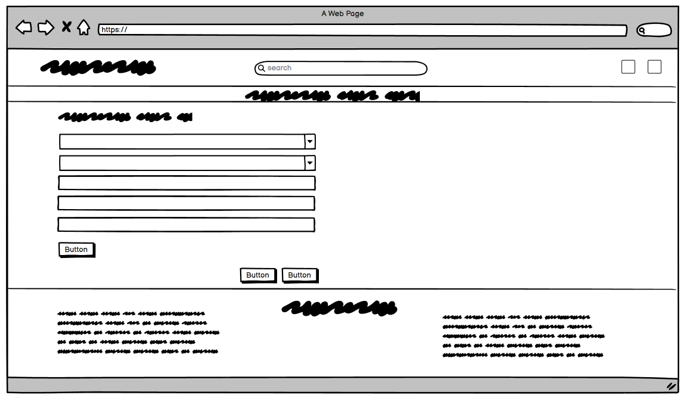
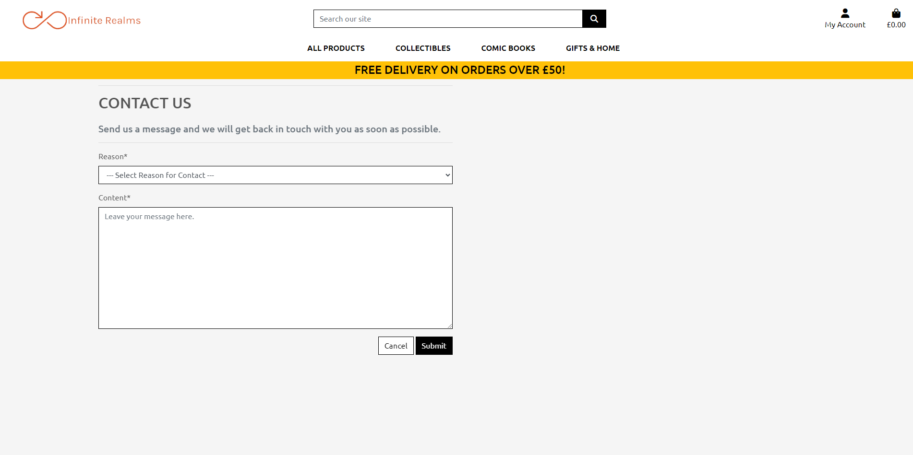

# Infinite Realms
----------------
This website was created as the 4th Milestone Project for Code Institute's web application development course.

  

**[Link to the Deployed Site](https://infinite-realms-366e4ca2f09e.herokuapp.com/)**
  
----------------

## Contents
  

* [User Experience](#user-experience)
    * [Owner Goals](#owners-goals)
    * [Shoppers Goals](#shoppers-goals)
* [Design](#design)
    * [User Stories](#user-stories)
    * [WireFrames](#wireframes)
    * [Database Schema](#database-schema)
    * [Styling](#styling)
* [Feautres](#features)
    * [Multi-Page Features](#mutli-page-features)
    * [Homepage](#homepage)
    * [Products Page](#products)
    * [Product Details Page](#product-details-page)
    * [Bag Page](#bag-page)
    * [Checkout Page](#checkout-page)
* [Technologies](#technologies)
* [Testing](#testing)
* [Deployment](#deployment)

  

----------------

## User Experience

**Infinite Realms** is an online store specializing in anime collectibles, gifts, and comic books. This unique store caters to fans of Japanese pop culture, offering a wide range of products that celebrate the vibrant and captivating world of anime and manga.
  

### Owners Goals
- The owner aims to offer a carefully curated selection of anime collectibles, gifts, and comic books. This includes both well-loved classics and the latest releases, ensuring there's something for every fan.
- The owner wants customers to have a positive and enjoyable shopping experience. This includes a user-friendly website that is easily navigable.
- The owner wants to offer customers the ability to express their opinions, providing valuable insights for both the owner and potential buyers.
- Customer satisfaction is a top priority. The owner is dedicated to providing excellent customer service, which includes timely responses to inquiries, assistance with orders, and addressing any concerns that may arise.
  

### Shoppers Goals
- Shoppers want to browse through a diverse selection of anime collectibles, including figures, merchandise, and comics from their favorite series.
- Some shoppers may have specific products titles in mind that they're looking to find and purchase.
- Shoppers would want a user-friendly website with a secure checkout process to ensure a hassle-free shopping experience.
- Some shoppers may want to engage with the community through forums, discussions, or by leaving reviews for products they've purchased.
- Shoppers would want easy access to customer support in case they have any questions, concerns, or need assistance with their orders.
- Shoppers would want timely feedback from any interaction with the website, whether it's making a purchase or submitting an inquiry/ contacting the owner.
  

## Design
  

### User Stories

From the goals outlined above user stories were created to ensure that development efforts are aligned with user needs and preferences.

| **USER STORY #**                 | **AS A** | **I WANT TO BE ABLE TO...**                                                          | **SO THAT I CAN...**                                                                  |
| ------------------------------------ | --------------- | ---------------------------------------------------------------------------------------- | ----------------------------------------------------------------------------------------- |
| **VIEWING & NAVIGATION**         |                 |                                                                                          |                                                                                           |
| 1                                    | Shopper         | Easily navigate through the site.                                                        | Discover a comprehensive list of products.                                                |
| 2                                    | Shopper         | Browse products within a specific category.                                              | Easily locate products of interest without extensive searching.                           |
| 3                                    | Shopper         | Browse products within a specific subcategory.                                           | Efficiently identify desired products without sifting through numerous options.           |
| 4                                    | Shopper         | Access detailed information about individual products.                                   | Access product details including price, description,manufacturer, reviews and images.     |
| 5                                    | Shopper         | Conveniently view the total quantity of items in my shopping bag throughout my visit.    | Make informed purchasing decisions to stay within budget.                                 |
| 6                                    | Shopper         | Effortlessly switch between product categories and their corresponding subcategories.    | Quickly find specific products I'm searching for.                                         |
| **REGISTRATION & USER ACCOUNTS** |                 |                                                                                          |                                                                                           |
| 7                                    | Shopper         | Register for an account with ease.                                                       | Enjoy the convenience of a personal account with access to my profile.                    |
| 8                                    | Shopper         | Receive a confirmation email promptly after registering.                                 | Receive prompt confirmation of a successful account registration.                         |
| 9                                    | Shopper         | Conveniently log in and out of my shopper's account.                                     | Access and manage my personal account information.                                        |
| 10                                   | Shopper         | Effortlessly recover my password if forgotten.                                           | Easily recover access to my account if needed.                                            |
| 11                                   | Shopper         | Enjoy a personalized user profile.                                                       | Review my complete order history, review history and message history.                     |
| **SORTING & SEARCHING**          |                 |                                                                                          |                                                                                           |
| 12                                   | Shopper         | Sort available products based on preferences.                                            | Effortlessly identify products by price, category and subcategory or name.                |
| 13                                   | Shopper         | Organize products within a specific category.                                            | Locate the best-priced product within specific categories.                                |
| 14                                   | Shopper         | Arrange products within specific subcategories.                                          | Quickly determine the most suitable product for my preferences and needs.                 |
| 15                                   | Shopper         | Search for products by name or description with ease.                                    | Efficiently locate specific products I intend to purchase.                                |
| 16                                   | Shopper         | Quickly review search history and the number of results.                                 | Easily identify I am viewing the correct products.                                        |
| **PURCHASING & CHECKOUT**        |                 |                                                                                          |                                                                                           |
| 17                                   | Shopper         | Easily select desired quantities for products during the purchasing process.             | Avoid unintentionally selecting an incorrect product quantity.                            |
| 18                                   | Shopper         | Receive on-screen notifications when adding products to my shopping bag.                 | Receive instant feedback to confirm the accuracy of my actions or to rectify errors.      |
| 19                                   | Shopper         | View items in my shopping bag for easy checkout.                                         | Clearly see the total cost of my purchase and review the list of all items included.      |
| 20                                   | Shopper         | Adjust quantities for individual items in my shopping bag.                               | Effortlessly adjust my purchase details before proceeding to checkout.                    |
| 21                                   | Shopper         | Enter payment information securely and conveniently.                                     | Complete the checkout process swiftly and seamlessly.                                     |
| 22                                   | Shopper         | Trust that my personal and payment information is kept safe and secure.                  | Provide necessary information for the purchase with confidence.                           |
| 23                                   | Shopper         | Receive an order confirmation after completing a purchase.                               | Verify that all details provided are accurate to prevent any mistakes.                    |
| 24                                   | Shopper         | Get an email confirmation after the checkout process.                                    | Retain a confirmation of my purchase for future personal reference.                       |
| **PRODUCT REVIEWS**              |                 |                                                                                          |                                                                                           |
| 25                                   | Shopper         | Access available product reviews while browsing.                                         | Access valuable insights from other customers about the product.                          |
| 26                                   | Shopper         | Easily understand how to contribute my own reviews.                                      | Decide whether to contribute my own review based on personal experiences.                 |
| 27                                   | Shopper         | Submit my own review of the product.                                                     | Share my personal product experience with the community.                                  |
| 28                                   | Store Owner     | Edit or update previously submitted reviews.                                             | Choose to edit a review incase of inappropriate/offensive language, racism etc.           |
| 29                                   | Store Owner     | Delete a review if necessary.                                                            | Have the ability to completely remove unacceptable comments or discriminatory statements. |
| **CONTACT**                      |                 |                                                                                          |                                                                                           |
| 30                                   | Shopper         | Quickly locate the "Contact Us" page.                                                    | Reach out with any questions or concerns I may have in an efficient manner.               |
| 31                                   | Shopper         | Expect the contact form to offer various subjects for inquiries.                         | Communicate inquiries quickly and effectively with the support team.                      |
| 32                                   | Shopper         | Receive a confirmation message upon submitting the contact form.                         | Receive a clear confirmation that my message has been received.                           |
| 33                                   | Shopper         | Receive an email confirmation containing the details of my submitted message.            | Maintain a record of my communications for future personal reference.                     |
| **ADMIN & STORE MANAGEMENT**     |                 |                                                                                          |                                                                                           |
| 34                                   | Store Owner     | Add new products to the store.                                                           | Add new items to my store's inventory.                                                    |
| 35                                   | Store Owner     | Edit or update existing product information.                                             | Modify product details, including price, description, manufacturer etc.                   |
| 36                                   | Store Owner     | Remove products from the store.                                                          | Remove items that are no longer available for sale from the inventory.                    |
| 37                                   | Store Owner     | See all unresponded messages from users.                                                 | Respond to users in a timely manner.                                                      |
| 38                                   | Store Owner     | Have an easy to user interface to respond to enquiries and see details of the enquiries. | Respond to users enquiries with a detailed response.                                      |
  

### WireFrames 

Wireframes created using balsamiq.

Homepage - Desktop

 

Homepage - Mobile

 

Products - Desktop

 

Products - Mobile

 

Product Detail - Desktop

 

Product Detail - Mobile

 

Add Product - Desltop

 

Add Product - Mobile

 

Edit Product - Desktop

 

Edit Product - mobile

 

Add Review - Desktop

 

Add Review - Mobile

 

Edit Review - Desktop

 

Edit Review - Mobile

 

Bag - Desktop

 

Bag - Mobile

 

Checkout - Desktop

 

Checkout - Mobile

 

Checkout Success - Desktop

 

Checkout Success - Mobile

 

Register - Desktop

 

Register - Mobile

 

Login - Desktop

 

Login - Mobile

 

Logout - Desktop

 

Logout - Mobile

 

Contact Us - Desktop

 

Contact Us - Mobile

 

Profile - Desktop

 

Profile - Mobile

 

Enquiries - Desktop

 

Enquiries - Mobile

 

Send Response - Desktop

 

Send Response - Mobile

 

404 - Desktop

 

404 - Mobile

 

  

### Database Schema

Schema to show tables in database along with thier relation to each other, also included is the allauth-user schema to show custom tables realationship.

  

### Styling

 A Minimalist color scheme helps direct the viewer's attention to the products themselves. Without overly vibrant or distracting colors, the products take center stage, allowing potential customers to focus on their features and details. Minimalist color palettes are often associated with modern design and a clean, sophisticated aesthetic.  It aids in making the website look clean, organized, and well-curated.

 Ubuntu was chosen as the font-family for the website as the Ubuntu font is a versatile typeface that balances readability with a modern, friendly aesthetic. Its widespread use in the Ubuntu operating system and beyond attests to its popularity and effectiveness in digital communication.

 The background imagery for both the homepage and authentication pages was crafted using [Ideogram](https://ideogram.ai/), an advanced AI-powered design tool. This deliberate choice reflects a commitment to a distinctive visual identity, setting our website apart with a unique and memorable aesthetic.

 The product images featured on our website were carefully curated from [Forbidden Planet](https://forbiddenplanet.com/), a renowned source for high-quality collectibles, gifts, and comic books. This deliberate choice ensures that our customers have access to authentic and sought-after merchandise from a reputable and trusted supplier.
   

 ## Features

 ### Mutli-Page Features

 #### Navbar

The website's navigation comprises two key elements: the top navigation and the main navigation. The top navigation, depicted below, features essential functionalities. Visitors can access the site's logo, conduct product searches using the search bar, and either "Register" or "Login" via the "My Account" icon. Additionally, users can easily view the total number of items in their shopping bag. Once signed in, the options available in the "My Account" dropdown menu vary based on the user's level. Shop Owners/Administrators have access to "Product Management" and "Enquiries", while shoppers can navigate to "My Profile" or "Contact Us". Both user types possess the ability to log out from the "My Account" dropdown.

The second component, the main navigation, empowers visitors to explore various product categories. This component is accessible through the hamburger icon on mobile devices. This navigation system and all of its constituent elements have been meticulously designed to be fully responsive, as exemplified by the accompanying screenshots.

Navbar - Desktop

 

Navbar - Mobile

 

My Account - Logged out

 

My Account - Shopper

 

My Account - Shop Owner/Administrator

 

This deliberate design ensures that visitors can seamlessly and intuitively navigate the site, regardless of their device or screen size, enhancing their overall browsing experience.
  

#### Footer

The footer is a consistent element present on every page of the website. It serves as a valuable navigation tool for mobile users, providing direct access to the homepage, especially since the navbar logo may not be easily accessible on smaller screens.

Within the footer, users will find a concise "About Us" section, offering a brief overview of the store's mission or purpose. Additionally, there are links to social media accounts, allowing users to connect with the brand on various platforms and stay updated with the latest news and promotions.

A noteworthy disclaimer is also included, informing users that any payments processed through Stripe are conducted in a test mode. This ensures transparency and sets clear expectations for users engaging in transactions on the site.

Overall, the footer serves as a well-structured and informative section, enhancing user experience by providing easy access to key information and navigation options, while also reinforcing trust and transparency in the payment process.

Footer - Desktop

 

Footer - Mobile

 

  

#### Modal

The inclusion of modals is a deliberate design choice implemented in scenarios where a delete action is initiated by the user. This feature serves as a protective measure to mitigate the risk of accidental deletions.

When a user clicks on a delete button, a modal window is triggered, prompting the user to confirm their intention to proceed with the deletion. This additional step acts as a safeguard, providing users with a final opportunity to reconsider before committing to the action.

By incorporating modals in this context, the website prioritizes user experience and safety, ensuring that critical operations, such as deletions, are deliberate and intentional, thereby reducing the likelihood of unintended consequences.

Modal - Delete Product

 

Modal - Delete Review

 

  

#### Favicon 

The website's favicon, the small icon displayed in the browser tab, was created by cropping the initial section of the navbar logo. This customized favicon was generated using the online tool available at [Favicon](https://favicon.io/). This distinctive icon enhances brand recognition and provides a visual representation of the website for users navigating through multiple browser tabs.

Favicon

 

  

### Homepage

The homepage has a minimalist design, featuring a tagline that encapsulates the essence of the store. A Call-to-Action (CTA) button guides visitors to explore the comprehensive range of products available on the site. This deliberate simplicity ensures that the homepage remains uncluttered, with a special emphasis on directing the user to the diverse collection of anime apparel.

Homepage - Desktop

 

Homepage - Mobile

 

  

### Products

The Products Page dynamically showcases products sourced from the database, contingent upon selected filtering options including category, subcategory and search terms.

Products - Desktop

 

Products - Mobile

 

  

 **Products Page Components**

 1. Heading Display: This section prominently displays either "All Products" or the name of the currently selected category, providing users with clear context regarding the displayed products.

All Products Heading

 

Category Heading

 

  

2. Subcategory Buttons: Located beneath the heading, these buttons represent subcategories within the selected category (if one selected). The currently selected subcategory has differing styling, providing users with clear navigation cues.

Statues Subcategory

 

Soft & Plush Subcategory

 

  

3. Products Information: Positioned below the sort selector on mobile and to the left of the page on desktop, this paragraph provides users with essential information. It includes details such as the total number of products available and any active search terms.

Products Information - Desktop

 

Products Information - Mobile

 

  

4. Sort Selector: A dropdown menu located near the top of the page, allowing users to sort products based on various criteria such as price, name, manufacturer, category, and subcategory.

Sort Selector

 

  

5. Product Cards: Each product is displayed in an individual card format. Cards are arranged in coloum amounts suitable for screen size of the user. The card includes:

* Product Image: Clickable and serves as a direct link to the product's detail page, providing users with a visual representation of the product.
* Product Name: Clearly states the name of the product.
* Manufacturer: Displays the name of the manufacturer or publisher responsible for producing the product.
* Price: Indicates the cost of the product.
* Category and Subcategory: Specifies the specific category and subcategory to which the product belongs redirects to a view of products filtered by relevant category or subcategory.

Product Card

 

  

6. Edit and Delete Links: Additional options available on product cards to shop owners or administrators. These links allow for administrative actions to be performed on the product.

Edit and Delete Links

 

  

### Product Details Page

 The Product Deatails Page plays a pivotal role in guiding users through their shopping journey, providing them with the information and tools they need to make informed purchasing decisions. It combines visual appeal with functional features to create an engaging and user-friendly shopping experience.

Product Details - Desktop

 

Product Details - Mobile

 

  

 **Product Details Page Components**

 1. Product Image: Presents a visual representation of the product, providing users with a clear view of what they are considering. Image will open in new tab if clicked enabling user closer inspection, in further development image would open in zoomable modal.

 2. Product Information:

    * Product Name: Clearly states the name of the product.
    * Price: Indicates the cost of the product.
    * Category and Subcategory: Specifies the specific category and subcategory to which the product belongs redirects to a view of products filtered by relevant category or subcategory.
    * Manufacturer: Displays the name of the manufacturer or publisher responsible for producing the product.
    * Product Description: Offers a comprehensive overview of the product's features, specifications, and benefits, assisting users in making informed decisions.

Product Image and Information

 

  

3. Quantity Input Box: Allows users to specify the quantity of the product they wish to add to their shopping bag, ensuring precise ordering. Users are unable to select a quantity outside of the range 1-99, this acheived by disabling the use of the decrement and increment buttons on the quantity input and by checking the validity of the form on submission.

Quantity Input Box

 

  

4. "Keep Shopping" and "Add to Bag" Buttons: Offer two distinct options for user actions. "Keep Shopping" allows users to continue browsing products, while "Add to Bag" submits the quantity input form and places the selected item into their shopping bag.

"Keep Shopping" and "Add to Bag" Buttons

 

  

5. Reviews Section (Hidden by JS Click to Reveal): Conceals the reviews section by default, providing a cleaner interface. Users can choose to reveal the reviews by clicking on the heading, providing additional feedback and insights about the product. Revealing reviews section also enables the user to submit a review about the product by reavealing the "Leave a Review" Button. Ability to add reviews is limited to authenticated users.

Reviews Section - Collapsed

 

Reviews Section - Expanded

 

  

6. Edit and Delete Links: Additional options available on product details page to shop owners or administrators. These links are located undernath the product name and allow for administrative actions to be performed on the product.

Edit and Delete Links

 

  

### Bag page

The Bag page enhances the overall shopping experience by giving users control over their selections, enabling them to review and modify their choices, and providing transparent cost information.

Bag - Desktop

 

Bag - Mobile

 

  

 **Bag Page Components**
 
 1. Product Information Section:

* Product Image: Displays a visual representation of the product, providing users with a clear visual reference.

* Product Name: Identifies the name or title of the product, ensuring easy recognition.

* Product SKU: Provides a unique identifier for the product, aiding in inventory management.

* Product Price per Unit: Indicates the cost of a single unit of the product, allowing users to understand the pricing structure.

* Quantity Input Box: Allow users to increment or decrement the quantity of the product in their shopping bag, facilitating easy adjustments.

* Update Button: Enables users to update the quantity of the product currently in the bag, providing flexibility in their shopping choices.

* Remove Button: Allows users to remove the product from the bag if they decide not to proceed with the purchase.

* Sub-Total per Item: Displays the total cost for each individual product based on the quantity selected.

Product Information Section - Desktop

 

Product Information Section - Mobile

 

  

2. Bag Summary:

* Bag Total: Reflects the cumulative cost of all the items currently in the shopping bag.

* Delivery Cost: Indicates any associated delivery charges.

* Grand Total: Provides the total cost of all products in the shopping bag, including both product costs and any applicable delivery charges.

* Free Delivery Threshold Alert: If the grand total is below the free delivery threshold, a prominent text in red advises the shopper how much more they need to spend to qualify for free delivery.

Bag Summary

 

  

3. Shopping Bag Buttons:

Keep Shopping CTA: A button that redirects the user back to the products page, allowing them to continue browsing and adding more items to their shopping bag.

Secure Checkout: This button initiates the checkout process, leading the user to a secure page to complete their purchase.

Shopping Bag Buttons

 

  

### Checkout Page

The Checkout Page plays a pivotal role in ensuring a smooth and secure transition from product selection to order confirmation. It provides users with the necessary tools and information to review, confirm, and successfully complete their purchase.

Checkout - Desktop

 

Checkout - Mobile

 

  

**Checkout Page Components**

1. Order Form: Collects essential information from the user, including personal details, delivery address, and payment information. This ensures accurate processing and delivery of the order.

* User Details:
    - Full Name
    - Email Address
    - Phone Number

* Delivery Information:
    - Street Address Line 1
    - Street Address Line 2 (Optional)
    - Town/City
    - County/Region (Optional)
    - Country (Dropdown Selection)
    - Postal Code

* Payment Information:
    - Card Information (Handled by Stripe)

Order Form

 

  

2. Order Summary: Provides a clear and detailed overview of the user's selected items, including product images, quantities, names, and subtotals. This allows users to review their order before finalizing the purchase.

For Each Item in the Order:
* Product Image
* Quantity
* Product Name
* Subtotal for the Item

 At the Bottom of the Order Summary:
* Order Total
* Delivery Cost
* Grand Total
If the Grand Total is below the free delivery threshold, a red text warning will inform the user how much more they need to spend to qualify for free delivery.

Order Summary

 

  

3. Buttons:

"Adjust Bag" Button: Allows users to go back to the shopping bag page to make any necessary adjustments before finalizing the order.

"Complete Order" Button: Submits the order form for processing. Payment is handled securely by Stripe.

Checkout Buttons

 

  

4. User Authentication Links and Profile Integration:

If the user is not logged in, there are links provided to either register for a new account or log in if they already have an existing account. This ensures the accuracy of the delivery information and allows for order tracking.

If the user is logged in, a checkbox option is available to add this delivery information to their user profile. This feature streamlines the ordering process for future purchases, making it more convenient for the user.

User Authentication Links and Profile Integration

 

User Authentication Links and Profile Integration

 

  

### Checkout Success 

After the successful processing of an order, the shopper is automatically redirected to the Checkout Success Page. This page provides a comprehensive receipt that includes the following details:

Checkout Success - Desktop

 

Checkout Success - Mobile

 

  

**Checkout Success Page Components**

1. Order Information:

* Order Number or Reference ID.

* Order Details. Comprehensive information about each item in the order, including:
    - Product Name
    - Quantity
    - Price per Unit
    - Subtotal
    - Delivery Information:

* Details about where the order will be delivered, including:
    - Address
    - Any specific delivery instructions (if provided)
    - Billing Information:

* Summary of the billing details used for the transaction.

2. Return to Products Button:

This button allows the shopper to return to the Products Page, giving them the opportunity to explore more items or categories.

3. Confirmation Email:

A confirmation email is automatically sent to the user's provided email address. The email includes a summary of the order.

### Profile Page

The Profile Page serves as a hub for users to manage their default delivery information, review their order, reviews and enquiries history. It contributes to a seamless and personalized user experience. Ability to access profile page is limited to authenticated users.

Profile - Desktop

 

Profile - Mobile

 

  

**Profile Page Components**

1. Default Delivery Information Form:
* Full Name
* Street Address 1
* Street Address 2
* Town/City
* County/Region
* Country (Dropdown Selection)
* Postal Code

Default Delivery Information

 

  

2. Accordion Sections:
* Order History:
Displays past orders with the following details for each order:
- Order Number (Link to Past Order Confirmation)
- Date of Order
- Items in Order
- Order Total

Order History

 

  

* Reviews Section:
Lists all reviews made by the user, along with options for edit and delete actions.

Reviews

 

  

* Messages Section:
Displays contact form submissions made by the user, indicating whether a response has been sent or not.

Messages

 

  

Upon loading the page, the "Order History" section of the accordion is automatically open, displaying the user's order history.

Expanding another section automatically collapses the currently open section. This ensures that only one section of the accordion is open at a time, providing a clean and organized user interface.

### Contact Us

The purpose of the Contact Us page is to establish a direct and accessible communication channel between the users and the shop owner. Page is only available to authenticated users.

Contact Us- Desktop

 

Contact Us - Mobile

 

  

**Contact Us Page Components**

1. Contact Form:

* Dropdown Menu: Provides a range of options for users to select the reason why they want to contact the shop owner. This ensures that inquiries are categorized for efficient handling.

* Text Area: Allows users to compose and leave their message. This provides a space for users to articulate their inquiries, feedback, or requests in detail.

2. Confirmation Email to User:

A confirmation email is automatically sent to the user's provided email address. This email serves as a receipt and contains details of the enquiry that was sent to the shop owner.

### Add Review Page

When the user clicks the Leave a Review button on the product details page, they are redirected to the Add Review page for that product. The Add Review page contributes to a dynamic and interactive shopping experience, empowering users to share their opinions and contribute to the collective knowledge about products available in the store. Ability to add a review is limited to authenticated users.

Add Review- Desktop

 

Add Review - Mobile

 

  

**Profile Page Components**

1. Review Form:
* Title Field: Allows the user to input a title for their review.
* Textarea for Content: Provides a space for the user to write the content of their review.
* Rating Dropdown: Allows the user to select a rating from 0 to 5, indicating their overall satisfaction with the product.

Review Form

 

  

2. On desktop, an image of the product is available for reference while writing the review. Not available on mobile as it takes up to much screen real estate.

Desktop Image

 

  

### Edit Review Page

The Edit Review page serves the purpose of allowing users to make modifications to their existing reviews. It shares a similar structure with the Add Review page, but the form is prepopulated with the current review data. Ability to edit reviews is limited to the user that created the review or Shop Owner/Administrator.

Edit Review - Desktop

 

Edit Review - Mobile

 

  

### Add Product

 The Add Product page is an essential tool for maintaining and expanding the store's product catalog, allowing Shop Owner/Administrators to efficiently and accurately add new items for customers to explore and purchase. Access to this page is limited specifically to Superusers.

Add Product - Desktop

 

Add Product - Mobile

 

  

**Profile Page Components**

Add Product Form:
* Category Dropdown: Allows the user to select the appropriate category for the new product from a list of available categories stored in the database.
* Subcategory Dropdown: Populated dynamically based on the selected category, utilizing an AJAX request and response when category field is changed to provide relevant subcategory options.
* SKU: Enables the user to input the Stock Keeping Unit (SKU) for the new product.
* Name.
* Description.
* Manufacturer.
* Price Field.
* Product Image Widget: Provides functionality to upload an associated image with the new product.

Category and Subcategory Dropdowns

 
<video src="documentation/readme_images/add-product-selects.webm" controls="controls"></video>

  

### Edit Product Page

The Edit Products page serves the purpose of allowing users to make modifications to an existing product. It shares a similar structure with the Add Product page, but the form is prepopulated with the current product data. Ability to edit products is limited to the Shop Owner/Administrator.

Edit Product - Desktop

 

Edit Product - Mobile

 

  

## Technologies

### Languages

* HTML5 - for content and structure.
* CSS3 - for styling.
* JS/JQuery - for frontend functionality and functions that request and handle data from the backend.
* Python - for the backend functionality.
    * Python Modules used -
    * asgiref==3.7.2
    * boto3==1.28.62
    * botocore==1.31.62
    * dj-database-url==0.5.0
    * Django==3.2.21
    * django-allauth==0.41.0
    * django-countries==7.2.1
    * django-crispy-forms==1.14.0
    * django-storages==1.14.2
    * gunicorn==21.2.0
    * jmespath==1.0.1
    * oauthlib==3.2.2
    * Pillow==10.0.1
    * psycopg2==2.9.9
    * python3-openid==3.2.0
    * requests-oauthlib==1.3.1
    * s3transfer==0.7.0
    * sqlparse==0.4.4
    * stripe==6.6.0
    * urllib3==1.26.17
  

### Tools

* Cloudconvert - used to convert images to WEBP format.
* Tinypng - used to compress images.
* Baslamiq - used to create wireframes.
* Logo.com - used to create logo.
* Diagrams.net - used to create DB schema.
* Am I Responsive - used to create responsive mockup for readme.
* Google Dev Tools - used for troubleshooting during development.
* Git/Github - used for version control and storage.
* Bootstrap - used for layout, positioning and styling.
* Favicon.io - used to create favicon.
* FontAwesome - used for icons.
* Heroku - used for deployment.
* Djecrety - used to create secret keys.
* AWS S3 - used to store images and static files.
* Stripe - Used to process the payment information.
* SQLite - Used for database for local development.
* ElepehantSQL - Used to host the production database.
  

## Testing

For testing please see the [Testing](/TESTING.md) documentation.
  

## Deployment

For deployment please see the [Testing](/DEPLOYMENT.md) documentation.
  