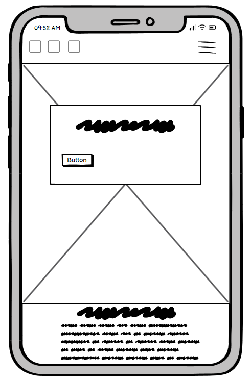
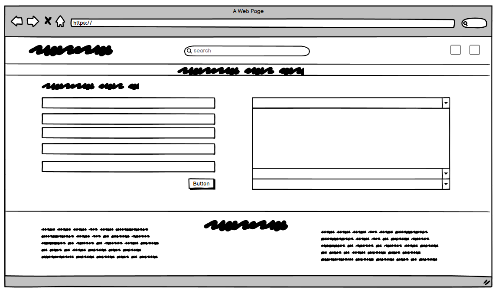

# Infinite Realms
----------------
This website was created as the 4th Milestone Project for Code Institute's web application development course.

  

**[Link to the Deployed Site](https://infinite-realms-366e4ca2f09e.herokuapp.com/)**
  
----------------

## Contents
  

* [User Experience](#user-experience)
    * [Owner Goals](#owners-goals)
    * [Shoppers Goals](#shoppers-goals)
* [Design](#design)
    * [User Stories](#user-stories)
    * [WireFrames](#wireframes)
    * [Database Schema](#database-schema)
    * [Styling](#styling)
* [Feautres](#features)
    * [Multi-Page Features](#mutli-page-features)

  

----------------

## User Experience

**Infinite Realms** is an online store specializing in anime collectibles, gifts, and comic books. This unique store caters to fans of Japanese pop culture, offering a wide range of products that celebrate the vibrant and captivating world of anime and manga.
  

### Owners Goals
- The owner aims to offer a carefully curated selection of anime collectibles, gifts, and comic books. This includes both well-loved classics and the latest releases, ensuring there's something for every fan.
- The owner wants customers to have a positive and enjoyable shopping experience. This includes a user-friendly website that is easily navigable.
- The owner wants to offer customers the ability to express their opinions, providing valuable insights for both the owner and potential buyers.
- Customer satisfaction is a top priority. The owner is dedicated to providing excellent customer service, which includes timely responses to inquiries, assistance with orders, and addressing any concerns that may arise.
  

### Shoppers Goals
- Shoppers want to browse through a diverse selection of anime collectibles, including figures, merchandise, and comics from their favorite series.
- Some shoppers may have specific products titles in mind that they're looking to find and purchase.
- Shoppers would want a user-friendly website with a secure checkout process to ensure a hassle-free shopping experience.
- Some shoppers may want to engage with the community through forums, discussions, or by leaving reviews for products they've purchased.
- Shoppers would want easy access to customer support in case they have any questions, concerns, or need assistance with their orders.
- Shoppers would want timely feedback from any interaction with the website, whether it's making a purchase or submitting an inquiry/ contacting the owner.
  

## Design
  

### User Stories

From the goals outlined above user stories were created to ensure that development efforts are aligned with user needs and preferences.

| **USER STORY #**                 | **AS A** | **I WANT TO BE ABLE TO...**                                                          | **SO THAT I CAN...**                                                                  |
| ------------------------------------ | --------------- | ---------------------------------------------------------------------------------------- | ----------------------------------------------------------------------------------------- |
| **VIEWING & NAVIGATION**         |                 |                                                                                          |                                                                                           |
| 1                                    | Shopper         | Easily navigate through the site.                                                        | Discover a comprehensive list of products.                                                |
| 2                                    | Shopper         | Browse products within a specific category.                                              | Easily locate products of interest without extensive searching.                           |
| 3                                    | Shopper         | Browse products within a specific subcategory.                                           | Efficiently identify desired products without sifting through numerous options.           |
| 4                                    | Shopper         | Access detailed information about individual products.                                   | Access product details including price, description,manufacturer, reviews and images.     |
| 5                                    | Shopper         | Conveniently view the total quantity of items in my shopping bag throughout my visit.    | Make informed purchasing decisions to stay within budget.                                 |
| 6                                    | Shopper         | Effortlessly switch between product categories and their corresponding subcategories.    | Quickly find specific products I'm searching for.                                         |
| **REGISTRATION & USER ACCOUNTS** |                 |                                                                                          |                                                                                           |
| 7                                    | Shopper         | Register for an account with ease.                                                       | Enjoy the convenience of a personal account with access to my profile.                    |
| 8                                    | Shopper         | Receive a confirmation email promptly after registering.                                 | Receive prompt confirmation of a successful account registration.                         |
| 9                                    | Shopper         | Conveniently log in and out of my shopper's account.                                     | Access and manage my personal account information.                                        |
| 10                                   | Shopper         | Effortlessly recover my password if forgotten.                                           | Easily recover access to my account if needed.                                            |
| 11                                   | Shopper         | Enjoy a personalized user profile.                                                       | Review my complete order history, review history and message history.                     |
| **SORTING & SEARCHING**          |                 |                                                                                          |                                                                                           |
| 12                                   | Shopper         | Sort available products based on preferences.                                            | Effortlessly identify products by price, category and subcategory or name.                |
| 13                                   | Shopper         | Organize products within a specific category.                                            | Locate the best-priced product within specific categories.                                |
| 14                                   | Shopper         | Arrange products within specific subcategories.                                          | Quickly determine the most suitable product for my preferences and needs.                 |
| 15                                   | Shopper         | Search for products by name or description with ease.                                    | Efficiently locate specific products I intend to purchase.                                |
| 16                                   | Shopper         | Quickly review search history and the number of results.                                 | Easily identify I am viewing the correct products.                                        |
| **PURCHASING & CHECKOUT**        |                 |                                                                                          |                                                                                           |
| 17                                   | Shopper         | Easily select desired quantities for products during the purchasing process.             | Avoid unintentionally selecting an incorrect product quantity.                            |
| 18                                   | Shopper         | Receive on-screen notifications when adding products to my shopping bag.                 | Receive instant feedback to confirm the accuracy of my actions or to rectify errors.      |
| 19                                   | Shopper         | View items in my shopping bag for easy checkout.                                         | Clearly see the total cost of my purchase and review the list of all items included.      |
| 20                                   | Shopper         | Adjust quantities for individual items in my shopping bag.                               | Effortlessly adjust my purchase details before proceeding to checkout.                    |
| 21                                   | Shopper         | Enter payment information securely and conveniently.                                     | Complete the checkout process swiftly and seamlessly.                                     |
| 22                                   | Shopper         | Trust that my personal and payment information is kept safe and secure.                  | Provide necessary information for the purchase with confidence.                           |
| 23                                   | Shopper         | Receive an order confirmation after completing a purchase.                               | Verify that all details provided are accurate to prevent any mistakes.                    |
| 24                                   | Shopper         | Get an email confirmation after the checkout process.                                    | Retain a confirmation of my purchase for future personal reference.                       |
| **PRODUCT REVIEWS**              |                 |                                                                                          |                                                                                           |
| 25                                   | Shopper         | Access available product reviews while browsing.                                         | Access valuable insights from other customers about the product.                          |
| 26                                   | Shopper         | Easily understand how to contribute my own reviews.                                      | Decide whether to contribute my own review based on personal experiences.                 |
| 27                                   | Shopper         | Submit my own review of the product.                                                     | Share my personal product experience with the community.                                  |
| 28                                   | Store Owner     | Edit or update previously submitted reviews.                                             | Choose to edit a review incase of inappropriate/offensive language, racism etc.           |
| 29                                   | Store Owner     | Delete a review if necessary.                                                            | Have the ability to completely remove unacceptable comments or discriminatory statements. |
| **CONTACT**                      |                 |                                                                                          |                                                                                           |
| 30                                   | Shopper         | Quickly locate the "Contact Us" page.                                                    | Reach out with any questions or concerns I may have in an efficient manner.               |
| 31                                   | Shopper         | Expect the contact form to offer various subjects for inquiries.                         | Communicate inquiries quickly and effectively with the support team.                      |
| 32                                   | Shopper         | Receive a confirmation message upon submitting the contact form.                         | Receive a clear confirmation that my message has been received.                           |
| 33                                   | Shopper         | Receive an email confirmation containing the details of my submitted message.            | Maintain a record of my communications for future personal reference.                     |
| **ADMIN & STORE MANAGEMENT**     |                 |                                                                                          |                                                                                           |
| 34                                   | Store Owner     | Add new products to the store.                                                           | Add new items to my store's inventory.                                                    |
| 35                                   | Store Owner     | Edit or update existing product information.                                             | Modify product details, including price, description, manufacturer etc.                   |
| 36                                   | Store Owner     | Remove products from the store.                                                          | Remove items that are no longer available for sale from the inventory.                    |
| 37                                   | Store Owner     | See all unresponded messages from users.                                                 | Respond to users in a timely manner.                                                      |
| 38                                   | Store Owner     | Have an easy to user interface to respond to enquiries and see details of the enquiries. | Respond to users enquiries with a detailed response.                                      |
  

### WireFrames 

Wireframes created using balsamiq.

Homepage - Desktop

 

Homepage - Mobile

 

Products - Desktop

 

Products - Mobile

 

Product Detail - Desktop

 

Product Detail - Mobile

 

Add Product - Desltop

 

Add Product - Mobile

 

Edit Product - Desktop

 

Edit Product - mobile

 

Add Review - Desktop

 

Add Review - Mobile

 

Edit Review - Desktop

 

Edit Review - Mobile

 

Bag - Desktop

 

Bag - Mobile

 

Checkout - Desktop

 

Checkout - Mobile

 

Checkout Success - Desktop

 

Checkout Success - Mobile

 

Register - Desktop

 

Register - Mobile

 

Login - Desktop

 

Login - Mobile

 

Logout - Desktop

 

Logout - Mobile

 

Contact Us - Desktop

 

Contact Us - Mobile

 

Profile - Desktop

 

Profile - Mobile

 

Enquiries - Desktop

 

Enquiries - Mobile

 

Send Response - Desktop

 

Send Response - Mobile

 

404 - Desktop

 

404 - Mobile

 

  

### Database Schema

Schema to show tables in database along with thier relation to each other, also included is the allauth-user schema to show custom tables realationship.

  

### Styling

 A Minimalist color scheme helps direct the viewer's attention to the products themselves. Without overly vibrant or distracting colors, the products take center stage, allowing potential customers to focus on their features and details. Minimalist color palettes are often associated with modern design and a clean, sophisticated aesthetic.  It aids in making the website look clean, organized, and well-curated.

 Ubuntu was chosen as the font-family for the website as the Ubuntu font is a versatile typeface that balances readability with a modern, friendly aesthetic. Its widespread use in the Ubuntu operating system and beyond attests to its popularity and effectiveness in digital communication.

 The background imagery for both the homepage and authentication pages was crafted using [Ideogram](https://ideogram.ai/), an advanced AI-powered design tool. This deliberate choice reflects a commitment to a distinctive visual identity, setting our website apart with a unique and memorable aesthetic.

 The product images featured on our website were carefully curated from [Forbidden Planet](https://forbiddenplanet.com/), a renowned source for high-quality collectibles, gifts, and comic books. This deliberate choice ensures that our customers have access to authentic and sought-after merchandise from a reputable and trusted supplier.
   

 ## Features

 ### Mutli-Page Features

 #### Navbar

The website's navigation comprises two key elements: the top navigation and the main navigation. The top navigation, depicted below, features essential functionalities. Visitors can access the site's logo, conduct product searches using the search bar, and either "Register" or "Login" via the "My Account" icon. Additionally, users can easily view the total number of items in their shopping bag. Once signed in, the options available in the "My Account" dropdown menu vary based on the user's level. Shop Owners/Administrators have access to "Product Management" and "Enquiries", while shoppers can navigate to "My Profile" or "Contact Us". Both user types possess the ability to log out from the "My Account" dropdown.

The second component, the main navigation, empowers visitors to explore various product categories. This component is accessible through the hamburger icon on mobile devices. This navigation system and all of its constituent elements have been meticulously designed to be fully responsive, as exemplified by the accompanying screenshots.

Navbar - Desktop

 

Navbar - Mobile

 

My Account - Logged out

 

My Account - Shopper

 

My Account - Shop Owner/Administrator

 

This deliberate design ensures that visitors can seamlessly and intuitively navigate the site, regardless of their device or screen size, enhancing their overall browsing experience.
  

#### Footer

The footer is a consistent element present on every page of the website. It serves as a valuable navigation tool for mobile users, providing direct access to the homepage, especially since the navbar logo may not be easily accessible on smaller screens.

Within the footer, users will find a concise "About Us" section, offering a brief overview of the store's mission or purpose. Additionally, there are links to social media accounts, allowing users to connect with the brand on various platforms and stay updated with the latest news and promotions.

A noteworthy disclaimer is also included, informing users that any payments processed through Stripe are conducted in a test mode. This ensures transparency and sets clear expectations for users engaging in transactions on the site.

Overall, the footer serves as a well-structured and informative section, enhancing user experience by providing easy access to key information and navigation options, while also reinforcing trust and transparency in the payment process.

Footer - Desktop

 

Footer - Mobile

 

  

#### Modal

The inclusion of modals is a deliberate design choice implemented in scenarios where a delete action is initiated by the user. This feature serves as a protective measure to mitigate the risk of accidental deletions.

When a user clicks on a delete button, a modal window is triggered, prompting the user to confirm their intention to proceed with the deletion. This additional step acts as a safeguard, providing users with a final opportunity to reconsider before committing to the action.

By incorporating modals in this context, the website prioritizes user experience and safety, ensuring that critical operations, such as deletions, are deliberate and intentional, thereby reducing the likelihood of unintended consequences.

Modal - Delete Product

 

Modal - Delete Review

 

  

#### Favicon 

The website's favicon, the small icon displayed in the browser tab, was created by cropping the initial section of the navbar logo. This customized favicon was generated using the online tool available at [Favicon](https://favicon.io/). This distinctive icon enhances brand recognition and provides a visual representation of the website for users navigating through multiple browser tabs.

Favicon

 

  

### Homepage

The homepage has a minimalist design, featuring a tagline that encapsulates the essence of the store. A Call-to-Action (CTA) button guides visitors to explore the comprehensive range of products available on the site. This deliberate simplicity ensures that the homepage remains uncluttered, with a special emphasis on directing the user to the diverse collection of anime apparel.

Homepage - Desktop

 

Homepage - Mobile

 

  

### Products

The Products Page dynamically showcases products sourced from the database, contingent upon selected filtering options including category, subcategory and search terms.

Products - Desktop

 

Products - Mobile

 

  

 **Products Page Components**

 1. Heading Display: This section prominently displays either "All Products" or the name of the currently selected category, providing users with clear context regarding the displayed products.

All Products Heading

 

Category Heading

 

  

2. Subcategory Buttons: Located beneath the heading, these buttons represent subcategories within the selected category (if one selected). The currently selected subcategory has differing styling, providing users with clear navigation cues.

Statues Subcategory

 

Soft & Plush Subcategory

 

  

3. Products Information: Positioned below the sort selector on mobile and to the left of the page on desktop, this paragraph provides users with essential information. It includes details such as the total number of products available and any active search terms.

Products Information - Desktop

 

Products Information - Mobile

 

  

4. Sort Selector: A dropdown menu located near the top of the page, allowing users to sort products based on various criteria such as price, name, manufacturer, category, and subcategory.

Sort Selector - Desktop

 

Sort Selector - Mobile

 

  

5. Product Cards: Each product is displayed in an individual card format. Cards are arranged in coloum amounts suitable for screen size of the user. The card includes:

* Product Image: Clickable and serves as a direct link to the product's detail page, providing users with a visual representation of the product.
* Product Name: Clearly states the name of the product.
* Manufacturer: Displays the name of the manufacturer or publisher responsible for producing the product.
* Price: Indicates the cost of the product.
* Category and Subcategory: Specifies the specific category and subcategory to which the product belongs redirects to a view of products filtered by relevant category or subcategory.

Product Card

 

  

6. Edit and Delete Links: Additional options available on product cards to shop owners or administrators. These links allow for administrative actions to be performed on the product.

Edit and Delete Links

 

  