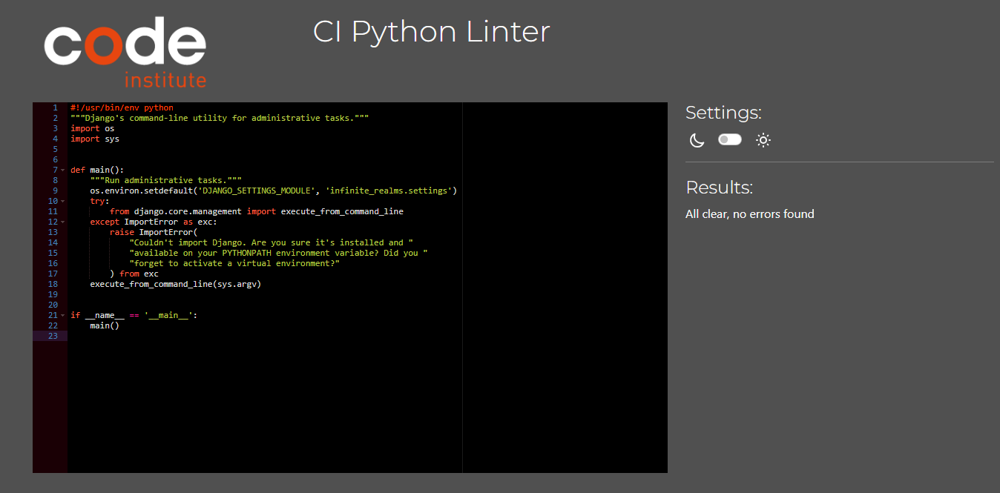
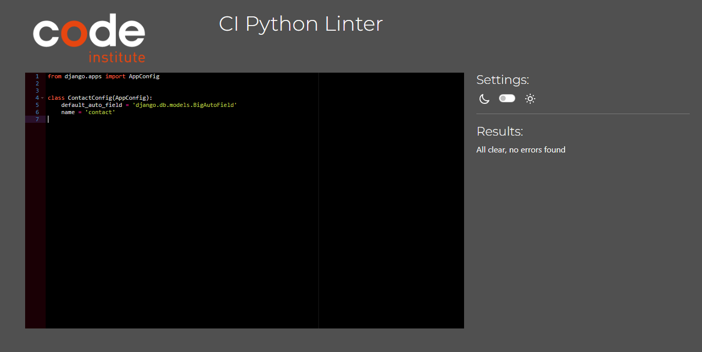
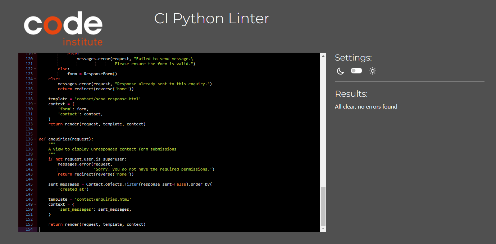
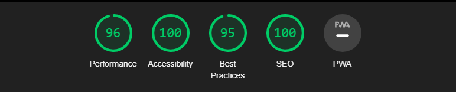
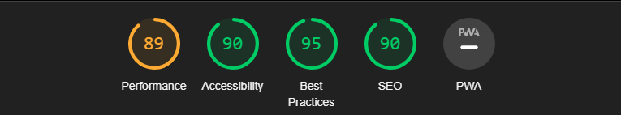
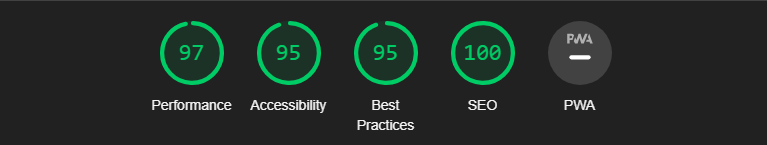
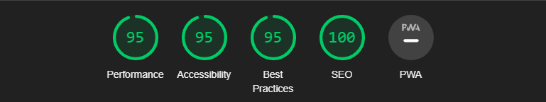
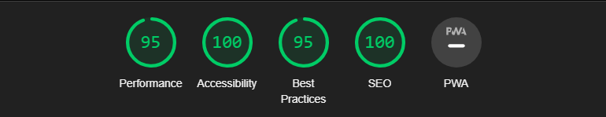

# Testing and Validation
----------------

  

**[Link to the Deployed Site](https://infinite-realms-366e4ca2f09e.herokuapp.com/)**
  
----------------

## Contents

* [Validation](#validation)
    * [HTML Validation](#html-validation)
    * [CSS Validation](#css-validation)
    * [JS Validation](#js-validation)
    * [Python Validation](#python-validation)
    * [Lighthouse Reports](#lighthouse-report)
    * [WAVE Accessibility](#wave-accessibility-checker)
  

----------------

## Validation

### HTML Validation

All pages tested for  HTML Validation at [W3C markup validation service](https://validator.w3.org/)  with no errors or warnings.

Homepage

 

Products

 

Product Detail

 

Add Product

 

Edit Product

 

Add Review

 

Edit Review

 

Bag

 

Checkout

 

Checkout Success

 

Register

 

Login

 

Logout

 

Contact

 

Profile

 

404

 

  

### CSS Validation

All static CSS files pass CSS Validation at [W3C CSS validation service](https://jigsaw.w3.org/css-validator/) with no errors.

base.css

 

checkout.css

 

profile.css

 

  

### JS Validation

JS files and scripts on templates run through [JShint](https://jshint.com/) for validation with no errors.

Scripts for update and remove links on Bag template.

 

Script to disable first option in select on Contact us template.

 

Script to update the text on image update on Add product and Edit product templates.

 

Script for back to top button on products template.

 

Script to add arguements to URL on change of sort selector on products template.

 

coutnryfield.js

 

stripe-elements.js

 

get_sub_categories_script.html

 

quantity_input_script.html

 

  

### Python Validation

Pylance used during development to detect errors and PEP8 compliance, but code also run through [CI PEP8 Linter](https://pep8ci.herokuapp.com/) and passed with no warnings.

#### Root Level

custom-storages.py

 

manage.py

 

#### Infinite Realms 

asgi.py

 

settings.py

 

urls.py

 

wsgi.py

 

#### Bag App

apps.py

 

contexts.py

 

forms.py

 

urls.py

 

views.py

 

templatetags/bag_tools.py

 

#### Checkout App

admin.py

 

apps.py

 

models.py

 

signals.py

 

urls.py

 

views.py

 

webhook_handler.py

 

webhooks.py

 

#### Contact App

admin.py

 

apps.py

 

forms.py

 

models.py

 

urls.py

 

views.py

 

#### Home App

apps.py

 

urls.py

 

views.py

 

#### Products App

admin.py

 

apps.py

 

forms.py

 

models.py

 

urls.py

 

views.py

 

widgets.py

 

#### Profiles App

apps.py

 

forms.py

 

models.py

 

urls.py

 

views.py

 

#### Reviews App

admin.py

 

apps.py

 

forms.py

 

models.py

 

urls.py

 

views.py

 

  

### Lighthouse Report

[Chrome DevTools' Lighthouse](https://developer.chrome.com/docs/lighthouse/overview/) was used to test the performance, accessibility, best practices and SEO of the site. Unfortunately, Best Practices was only ever 95 across the site instead of a desirable 100, investigation pointed towards warnings that cross-site cookies from Stripe will be blocked in future chrome versions. Looking into this, Stripe say they are endeavouring to continuely add support for this.

Homepage - Scores above 90.

 

Products - Performance only 89, but given there was 64 products on that page decided to overlook for now, as a page with just 9 products had a score of 93. Potentially pagination could be used to raise the performance value. SEO also only just 90 belive this to be checking the page as a superuser and Google warning of uncrawlable delete links, this would not affect a normal user.

 

Product Detail - Scores above 90.

 

Add Product - Scores above 90.

 

Edit Product - Scores above 90.

 

Add Review - Scores above 90.

 

Edit Review - Scores above 90.

 

Bag - Scores above 90.

 

Checkout - Scores above 90

 

Checkout Success - Scores above 90.

 

Register - Scores above 90.

 

Login - Scores above 90.

 

Logout - Scores above 90.

 

Contact - Scores above 90.

 

Profile - Scores above 90.

 

  

### WAVE Accessibility Checker

[WAVE](https://wave.webaim.org/) was used to ensure that site is also accessible to individuals with disabilities. WAVE effectively spots various accessibility and Web Content Accessibility Guideline (WCAG) issues, which are subsequently addressed based on the initial assessment outcomes.

Homepage - 0 Errors or Alerts.

 

Products - 0 Errors, 1 Alert for possible headings for price on product cards. Ignored as not meant to be heading.

 

Product Detail - 0 Errors, 1 Alert for same possible heading for price.

 

Add Product - 0 Errors or Alerts.

 

Edit Product - 0 Errors or Alerts.

 

Add Review - 0 Errors or Alerts.

 

Edit Review - 0 Errors or Alerts.

 

Bag - 0 Errors or Alerts.

 

Checkout - 1 Contrast Error. Points to placeholder in Country Select, decided to leave as its the same color as the other placeholders which pass contrast check. 1 Alert for skipped heading level but H1, H2, H3, H4 and H5 all present.

 

Checkout Success - 0 Errors or Alerts.

 

Register - 0 Errors or Alerts.

 

Login - 0 Errors or Alerts.

 

Logout - 0 Errors or Alerts.

 

Contact - 0 Errors, 1 Alert for redundant link. Points to home link in footer being redundant as also present in header. Strangely enough only present on this page, also as header link isn't available to mobile users it acts as a convenient link back to the homepage.

 

Profile - 1 Contrast error on same Country Select as checkout.html.

 

Enquiries - 0 Errors or Alerts.

 

Send Response - 0 Errors or Alerts.

 

404 - 0 Errors 1 alert. Redundant link back to homepage.

 

  
