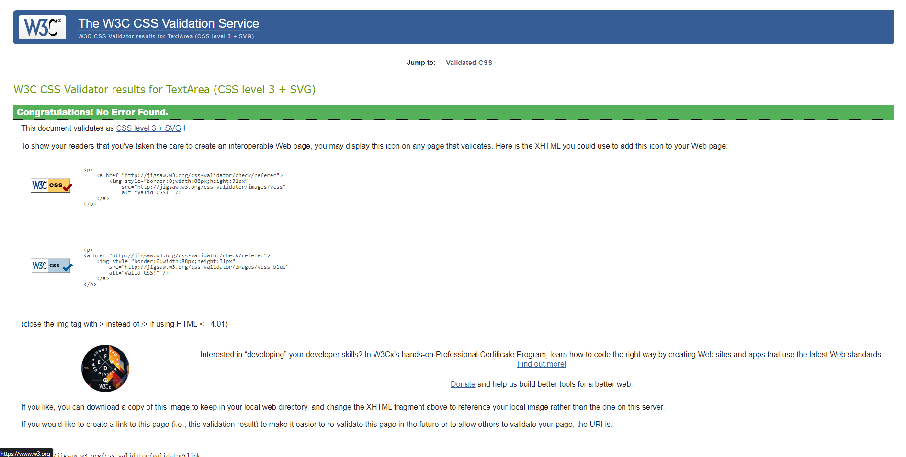
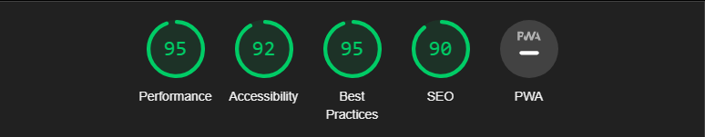
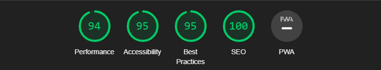
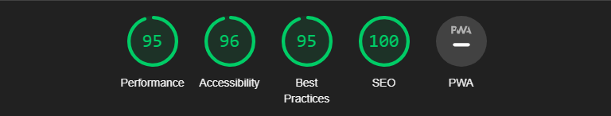

# Testing and Validation
----------------

  

**[Link to the Deployed Site](https://infinite-realms-366e4ca2f09e.herokuapp.com/)**
  
----------------

## Contents
  

* [Validation](#validation)
    * [HTML Validation](#html-validation)
    * [CSS Validation](#css-validation)
    * [JS Validation](#js-validation)
    * [Python Validation](#python-validation)
    * [Lighthouse Reports](#lighthouse-report)
    * [WAVE Accessibility](#wave-accessibility-checker)
* [User Story Testing](#user-story-testing)
* [Manual Testing](#manual-testing)
* [Responsiveness](#responsiveness)
  

----------------

## Validation
  

### HTML Validation

All pages tested for  HTML Validation at [W3C markup validation service](https://validator.w3.org/)  with no errors or warnings.

Homepage

 

Products

 

Product Detail

 

Add Product

 

Edit Product

 

Add Review

 

Edit Review

 

Bag

 

Checkout

 

Checkout Success

 

Register

 

Login

 

Logout

 

Contact

 

Profile

 

Enquiries

 

Send Response

 

404

 

  

### CSS Validation

All static CSS files pass CSS Validation at [W3C CSS validation service](https://jigsaw.w3.org/css-validator/) with no errors.

base.css

 

checkout.css

 

profile.css

 

  

### JS Validation

JS files and scripts on templates run through [JShint](https://jshint.com/) for validation with no errors.

Scripts for update and remove links on Bag template.

 

Script to disable first option in select on Contact us template.

 

Script to update the text on image update on Add product and Edit product templates.

 

Script for back to top button on products template.

 

Script to add arguments to URL on change of sort selector on products template.

 

countryfield.js

 

stripe-elements.js

 

get_sub_categories_script.html

 

quantity_input_script.html

 

  

### Python Validation

Pylance used during development to detect errors and PEP8 compliance, but code also run through [CI PEP8 Linter](https://pep8ci.herokuapp.com/) and passed with no warnings.

#### Root Level

custom-storages.py

 

manage.py

 

#### Infinite Realms 

asgi.py

 

settings.py

 

urls.py

 

wsgi.py

 

#### Bag App

apps.py

 

contexts.py

 

forms.py

 

urls.py

 

views.py

 

templatetags/bag_tools.py

 

#### Checkout App

admin.py

 

apps.py

 

models.py

 

signals.py

 

urls.py

 

views.py

 

webhook_handler.py

 

webhooks.py

 

#### Contact App

admin.py

 

apps.py

 

forms.py

 

models.py

 

urls.py

 

views.py

 

#### Home App

apps.py

 

urls.py

 

views.py

 

#### Products App

admin.py

 

apps.py

 

forms.py

 

models.py

 

urls.py

 

views.py

 

widgets.py

 

#### Profiles App

apps.py

 

forms.py

 

models.py

 

urls.py

 

views.py

 

#### Reviews App

admin.py

 

apps.py

 

forms.py

 

models.py

 

urls.py

 

views.py

 

  

### Lighthouse Report

[Chrome DevTools' Lighthouse](https://developer.chrome.com/docs/lighthouse/overview/) was used to test the performance, accessibility, best practices and SEO of the site. Unfortunately, Best Practices was only ever 95 across the site instead of a desirable 100, investigation pointed towards warnings that cross-site cookies from Stripe will be blocked in future chrome versions. Looking into this, Stripe say they are endeavouring to continuely add support for this.

Homepage - Scores above 90.

 

Products - Performance only 89, but given there was 64 products on that page decided to overlook for now, as a page with just 9 products had a score of 93. Potentially pagination could be used to raise the performance value. SEO also only just 90 believe this to be checking the page as a superuser and Google warning of uncrawlable delete links, this would not affect a normal user.

 

Product Detail - Scores above 90.

 

Add Product - Scores above 90.

 

Edit Product - Scores above 90.

 

Add Review - Scores above 90.

 

Edit Review - Scores above 90.

 

Bag - Scores above 90.

 

Checkout - Scores above 90

 

Checkout Success - Scores above 90.

 

Register - Scores above 90.

 

Login - Scores above 90.

 

Logout - Scores above 90.

 

Contact - Scores above 90.

 

Enquiries - Scores above 90.

 

Send Response - Scores above 90.

 

Profile - Scores above 90.

 

  

### WAVE Accessibility Checker

[WAVE](https://wave.webaim.org/) was used to ensure that site is also accessible to individuals with disabilities. WAVE effectively spots various accessibility and Web Content Accessibility Guideline (WCAG) issues, which are subsequently addressed based on the initial assessment outcomes.

Homepage - 0 Errors or Alerts.

 

Products - 0 Errors, 1 Alert for possible headings for price on product cards. Ignored as not meant to be heading.

 

Product Detail - 0 Errors, 1 Alert for same possible heading for price.

 

Add Product - 0 Errors or Alerts.

 

Edit Product - 0 Errors or Alerts.

 

Add Review - 0 Errors or Alerts.

 

Edit Review - 0 Errors or Alerts.

 

Bag - 0 Errors or Alerts.

 

Checkout - 1 Contrast Error. Points to placeholder in Country Select, decided to leave as its the same color as the other placeholders which pass contrast check. 1 Alert for skipped heading level but H1, H2, H3, H4 and H5 all present.

 

Checkout Success - 0 Errors or Alerts.

 

Register - 0 Errors or Alerts.

 

Login - 0 Errors or Alerts.

 

Logout - 0 Errors or Alerts.

 

Contact - 0 Errors, 1 Alert for redundant link. Points to home link in footer being redundant as also present in header. Strangely enough only present on this page, also as header link isn't available to mobile users it acts as a convenient link back to the homepage.

 

Profile - 1 Contrast error on same Country Select as checkout.html.

 

Enquiries - 0 Errors or Alerts.

 

Send Response - 0 Errors or Alerts.

 

404 - 0 Errors 1 alert. Redundant link back to homepage.

 

  

## User Story Testing
  

| **USER STORY #**                 | **As A** | **I WANT TO BE ABLE TO...**                                                          | **SO THAT I CAN...**                                                                  | **FEATURE TO ACHIEVE THIS** this                                                                                                                                                                                                                                                                                                                                                                                                                                                                                                                                                                                                                                                                                                                                                                                                                                                                                                                        | **SCREENSHOTS** |
| ------------------------------------ | --------------- | ---------------------------------------------------------------------------------------- | ----------------------------------------------------------------------------------------- | ---------------------------------------------------------------------------------------------------------------------------------------------------------------------------------------------------------------------------------------------------------------------------------------------------------------------------------------------------------------------------------------------------------------------------------------------------------------------------------------------------------------------------------------------------------------------------------------------------------------------------------------------------------------------------------------------------------------------------------------------------------------------------------------------------------------------------------------------------------------------------------------------------------------------------------------------- | ----------- |
| **VIEWING & NAVIGATION**         |                 |                                                                                          |                                                                                           |                                                                                                                                                                                                                                                                                                                                                                                                                                                                                                                                                                                                                                                                                                                                                                                                                                                                                                                                                |             |
| 1                                    | Shopper         | Easily navigate through the site.                                                        | Discover a comprehensive list of products.                                                | The main navigation component of the navbar provides shoppers with a means to explore our product offerings. By clicking on the "All Products" link in the main navigation, visitors gain access to a comprehensive list of all available items on our site.                                                                                                                                                                                                                                                                                                                                                                                                                                                                                                                                                                                                                                                                                   |   [Desktop](documentation/user_story_testing/user-story-test-1-desktop.png), [Mobile](documentation/user_story_testing/user-story-test-1-mobile.png)     |
| 2                                    | Shopper         | Browse products within a specific category.                                              | Easily locate products of interest without extensive searching.                           | The main navigation feature of the site empowers shoppers to explore products within specific categories.                                                                                                                                                                                                                                                                                                                                                                                                                                                                                                                                                                                                                                                                                                                                                                                                                                      |      [Desktop](documentation/user_story_testing/user-story-test-2-desktop.png), [Mobile](documentation/user_story_testing/user-story-test-2-mobile.png)       |
| 3                                    | Shopper         | Browse products within a specific subcategory.                                           | Efficiently identify desired products without sifting through numerous options.           | The main navigation feature of the site empowers shoppers to explore products within specific subcategories.                                                                                                                                                                                                                                                                                                                                                                                                                                                                                                                                                                                                                                                                                                                                                                                                                                   |      [Desktop](documentation/user_story_testing/user-story-test-3-desktop.png), [Mobile](documentation/user_story_testing/user-story-test-3-mobile.png)       |
| 4                                    | Shopper         | Access detailed information about individual products.                                   | Access product details including price, description,manufacturer, reviews and images.     | When a shopper clicks on a product image within an individual product card, they are directed to the product detail page. This page showcases essential information about the product, including its name, image, manufacturer, category, subcategory, available reviews, pricing details, and a comprehensive description.                                                                                                                                                                                                                                                                                                                                                                                                                                                                                                                                                                                                                    |     [Desktop](documentation/user_story_testing/user-story-test-4-desktop.png), [Mobile](documentation/user_story_testing/user-story-test-4-mobile.png)        |
| 5                                    | Shopper         | Conveniently view the total quantity of items in my shopping bag throughout my visit.    | Make informed purchasing decisions to stay within budget.                                 | Upon adding a product to the shopping bag, a notification toast will promptly confirm the successful addition. Additionally, it will provide information on how much more a shopper needs to spend to qualify for free delivery (if the threshold has not been met). Beneath the bag icon, the ongoing total of items currently in the bag is shown. This information remains accessible as users navigate between different pages on the site, ensuring they can easily keep track of their current bag amount.                                                                                                                                                                                                                                                                                                                                                                                                                               |    [Desktop](documentation/user_story_testing/user-story-test-5-desktop.png), [Mobile](documentation/user_story_testing/user-story-test-5-mobile.png)         |
| 6                                    | Shopper         | Effortlessly switch between product categories and their corresponding subcategories.    | Quickly find specific products I'm searching for.                                         | The main navigation dropdown menu offers links to all product categories, including links to their respective subcategories. On the product page, each individual product card features clickable category and subcategory tags. When browsing through product categories, buttons are presented beneath the heading, showcasing available subcategories. Additionally, users are informed of the specific subcategory they are currently viewing through styling of respective button.                                                                                                                                                                                                                                                                                                                                                                                                                                                        |     [Sub-Category Buttons](documentation/user_story_testing/user-story-test-6-buttons.png), [Nav Links](documentation/user_story_testing/user-story-test-6-navlinks.png), [Category and Sub-Category Tags](documentation/user_story_testing/user-story-test-6-tags.png)        |
| **REGISTRATION & USER ACCOUNTS** |                 |                                                                                          |                                                                                           |                                                                                                                                                                                                                                                                                                                                                                                                                                                                                                                                                                                                                                                                                                                                                                                                                                                                                                                                                |             |
| 7                                    | Shopper         | Register for an account with ease.                                                       | Enjoy the convenience of a personal account with access to my profile.                    | Shoppers can effortlessly create an account through the site's top navigation, facilitated by the "My Account" icon. This icon features two dropdown links, with the first being "Sign Up." Selecting "Sign Up" opens the dedicated sign-up page, allowing users to register and establish an account. Additionally, for those without an existing account, there is an option to create one directly from the checkout page.                                                                                                                                                                                                                                                                                                                                                                                                                                                                                                                  |   [Nav Links Desktop](documentation/user_story_testing/user-story-test-7-navlink-desktop.png), [Nav Links Mobile](documentation/user_story_testing/user-story-test-7-navlink-mobile.png), [Prompts at Checkout](documentation/user_story_testing/user-story-test-7-checkout-prompts.png)          |
| 8                                    | Shopper         | Receive a confirmation email promptly after registering.                                 | Receive prompt confirmation of a successful account registration.                         | Upon registering for an account, a shopper will promptly receive an email containing a confirmation link for their new account. Clicking on this confirmation link will redirect the shopper to the login page. A notification toast will also appear, confirming the successful email confirmation.                                                                                                                                                                                                                                                                                                                                                                                                                                                                                                                                                                                                                                           |    [Confirmation Email](documentation/user_story_testing/user-story-test-8-email-confirmation.png), [Confirmation Page](documentation/user_story_testing/user-story-test-8-confirmation-page.png)         |
| 9                                    | Shopper         | Conveniently log in and out of my shopper's account.                                     | Access and manage my personal account information.                                        | Through the top navigation's "My Account" section, users can effortlessly log in and log out of their shopper's account. Upon successful login, a confirmation toast is displayed. Once logged in, shoppers gain access to their personal information via the My Account dropdown, which offers two options: "My Profile" and "Logout." Clicking on "My Profile" opens the logged-in user's personal profile page, where they can view and make edits to their default delivery information. Furthermore, the shopper's order history, submitted reviews, and contact form submissions are all conveniently accessible on this page.                                                                                                                                                                                                                                                                                                           |     [Login Page](documentation/user_story_testing/user-story-test-9-login-page.png), [Login Confirmation](documentation/user_story_testing/user-story-test-9-login-confirmation.png), [My Account Links](documentation/user_story_testing/user-story-test-9-my-account-links.png), [My Profile](documentation/user_story_testing/user-story-test-9-my-profile.png)        |
| 10                                   | Shopper         | Effortlessly recover my password if forgotten.                                           | Easily recover access to my account if needed.                                            | On the "accounts/login" page, registered shoppers have the option to select the "Forgot Password?" link, which directs them to the password reset page. Step 1: Users provide their email address to receive a password reset email. Step 2: Upon submission, users open the password reset email containing a secure link. Clicking this link redirects them to the "Change Password" page. Step 3: Users proceed to set a new password. A successful password change is confirmed with a toast message. Subsequently, the user can log in to their account using the new password. If a shopper enters an email address not associated with any user account, the password reset page will display an error message, notifying the user of the discrepancy.                                                                                                                                                                      |     [Forgot Password Link](documentation/user_story_testing/user-story-test-10-password-link.png), [Reset Password Form](documentation/user_story_testing/user-story-test-10-password-reset-form.png), [Confirmation Password Reset Link Sent](documentation/user_story_testing/user-story-test-10-password-reset-sent.png), [Email with Link to Reset](documentation/user_story_testing/user-story-test-10-password-reset-email.png), [New Password Form](documentation/user_story_testing/user-story-test-10-new-password-form.png), [New Password Confirmation](documentation/user_story_testing/user-story-test-10-new-password-confirmation.png)        |
| 11                                   | Shopper         | Enjoy a personalized user profile.                                                       | Review my complete order history, review history and message history.                     | A logged-in user, via their profile page, enjoys the convenience of accessing their order history, thoughtfully arranged in chronological order. Each order is accompanied by an Order Number link, providing seamless access to the respective order confirmation. Furthermore, the user's submitted reviews are prominently displayed, offering options to edit or delete as needed. Additionally, contact form submissions are presented conveniently, indicating whether a response has been sent to the user or not, allowing for easy reference and record-checking. This user-centric approach ensures a smooth and efficient experience.                                                                                                                                                                                                                                                                                               |    [Order History](documentation/user_story_testing/user-story-test-11-order-history.png), [Review History](documentation/user_story_testing/user-story-test-11-review-history.png), [Message History](documentation/user_story_testing/user-story-test-11-contact-history.png), [Past Order Confirmation](documentation/user_story_testing/user-story-test-11-past-order-confirmation.png)         |
| **SORTING & SEARCHING**          |                 |                                                                                          |                                                                                           |                                                                                                                                                                                                                                                                                                                                                                                                                                                                                                                                                                                                                                                                                                                                                                                                                                                                                                                                                |             |
| 12                                   | Shopper         | Sort available products based on preferences.                                            | Effortlessly identify products by price, category and subcategory or name.                | By utilizing the sort selector on the products page, users have the ability to arrange all available products based on various criteria including price, name, manufacturer, category, and subcategories. This feature empowers users to customize their browsing experience according to their preferences.                                                                                                                                                                                                                                                                                                                                                                                                                                                                                                                                                                                                                                   |      [Sort Selector](documentation/user_story_testing/user-story-test-12-sort-selector.png)       |
| 13                                   | Shopper         | Organize products within a specific category.                                            | Locate the best-priced product within specific categories.                                | From the main navigation, users can choose a specific product category. On the products page, users have the option to utilize the sort selector to arrange products within that specific category. This selector provides the flexibility to further refine the results, allowing users to find the best-priced product, among other options.                                                                                                                                                                                                                                                                                                                                                                                                                                                                                                                                                                                                 |    [Category Links](documentation/user_story_testing/user-story-test-13-categories.png), [Sort Selector](documentation/user_story_testing/user-story-test-13-sort-selector.png)         |
| 14                                   | Shopper         | Arrange products within specific subcategories.                                          | Quickly determine the most suitable product for my preferences and needs.                 | From the main navigation, users can choose a specific product subcategory. On the products page, users have the option to utilize the sort selector to arrange products within that specific subcategory. This selector provides the flexibility to further refine the results, allowing users to find the best-priced product, among other options.                                                                                                                                                                                                                                                                                                                                                                                                                                                                                                                                                                                           |    [Sub-Category Links](documentation/user_story_testing/user-story-test-14-subcategories.png), [Sort Selector](documentation/user_story_testing/user-story-test-14-sort-selector.png)         |
| 15                                   | Shopper         | Search for products by name or description with ease.                                    | Efficiently locate specific products I intend to purchase.                                | As indicated in the search bar's temporary text, users have the option to search for a product using its name or description.                                                                                                                                                                                                                                                                                                                                                                                                                                                                                                                                                                                                                                                                                                                                                                                                                  |     [Desktop](documentation/user_story_testing/user-story-test-15-searchbar-desktop.png), [Mobile](documentation/user_story_testing/user-story-test-15-searchbar-mobile.png)        |
| 16                                   | Shopper         | Quickly review search history and the number of results.                                 | Easily identify I am viewing the correct products.                                        | When users perform a search by product name or description, the results will also display the total number of matching products found for that search term.                                                                                                                                                                                                                                                                                                                                                                                                                                                                                                                                                                                                                                                                                                                                                                                    |    [Search Results](documentation/user_story_testing/user-story-test-16-search-results.png)         |
| **PURCHASING & CHECKOUT**        |                 |                                                                                          |                                                                                           |                                                                                                                                                                                                                                                                                                                                                                                                                                                                                                                                                                                                                                                                                                                                                                                                                                                                                                                                                |             |
| 17                                   | Shopper         | Easily select desired quantities for products during the purchasing process.             | Avoid unintentionally selecting an incorrect product quantity.                            | On the product detail page and within the shopping bag, shoppers have the capability to modify the quantity of items before proceeding to checkout. In both cases, users are only allowed to increase or decrease the item quantity by whole numbers, and the quantity cannot be set to zero.                                                                                                                                                                                                                                                                                                                                                                                                                                                                                                                                                                                                                                                  |    [Quantity Input Bag](documentation/user_story_testing/user-story-test-17-adjust-bag-quantity.png), [Adjusted Quantity](documentation/user_story_testing/user-story-test-17-quantity-adjusted.png), [Decrement Quantity Disabled](documentation/user_story_testing/user-story-test-17-decrement-disabled.png)         |
| 18                                   | Shopper         | Receive on-screen notifications when adding products to my shopping bag.                 | Receive instant feedback to confirm the accuracy of my actions or to rectify errors.      | Whenever a user adds a product to the shopping bag, a toast message is displayed. Additionally, if a user attempts to adjust the product quantity using a decimal number, a validation error will appear.                                                                                                                                                                                                                                                                                                                                                                                                                                                                                                                                                                                                                                                                                                                                      |   [Success Notification](), [Invalid Input](documentation/user_story_testing/user-story-test-18-decimal-error.png)          |
| 19                                   | Shopper         | View items in my shopping bag for easy checkout.                                         | Clearly see the total cost of my purchase and review the list of all items included.      | On the shopping bag page, shoppers can review the items they intend to purchase. This includes details such as the cost per item, the total cost for each item, the delivery fee (if the free delivery threshold hasn't been met), and the overall grand total.                                                                                                                                                                                                                                                                                                                                                                                                                                                                                                                                                                                                                                                                                |     [Bag Desktop](documentation/user_story_testing/user-story-test-19-desktop.png), [Bag Mobile](documentation/user_story_testing/user-story-test-19-mobile.png)        |
| 20                                   | Shopper         | Adjust quantities for individual items in my shopping bag.                               | Effortlessly adjust my purchase details before proceeding to checkout.                    | On the bag page, shoppers retain the ability to modify the quantity of items in their shopping bag, and they can also choose to remove items entirely. A notification toast will promptly appear, informing the shopper about any changes made, whether it's an update to the item quantity or the removal of an item from the bag.                                                                                                                                                                                                                                                                                                                                                                                                                                                                                                                                                                                                            |     [Quantity Input Bag and Remove Link](documentation/user_story_testing/user-story-test-20-update-quantity.png), [Update Confirmation](documentation/user_story_testing/user-story-test-20-update-confirmation.png), [Remove Confirmation](documentation/user_story_testing/user-story-test-20-remove-from-bag.png)        |
| 21                                   | Shopper         | Enter payment information securely and conveniently.                                     | Complete the checkout process swiftly and seamlessly.                                     | On the checkout page, shoppers can easily access the necessary information needed for a swift checkout process. This includes mandatory fields like their full name, email address, phone number, street address1, city or town, and country. Additionally, shoppers can view the payment details required, such as their card number, card expiration month and year, and the CVC. In case of inputting incorrect information, like using an expired credit card, an error message will be promptly displayed to the shopper, guiding them to rectify the issue.                                                                                                                                                                                                                                                                                                                                                                              |     [Delivery Information](documentation/user_story_testing/user-story-test-21-delivery-infromation.png), [Payment Information](documentation/user_story_testing/user-story-test-21-card-information.png), [Card Errors](documentation/user_story_testing/user-story-test-21-errors.png)        |
| 22                                   | Shopper         | Trust that my personal and payment information is kept safe and secure.                  | Provide necessary information for the purchase with confidence.                           | Infinite Realm's payment processing is facilitated through Stripe, a comprehensive suite of APIs that empowers online businesses, regardless of their size, with robust solutions for payment processing and e-commerce.                                                                                                                                                                                                                                                                                                                                                                                                                                                                                                                                                                                                                                                                                                                       |     [Stripe Security Information](https://stripe.com/docs/security?locale=en-GB)        |
| 23                                   | Shopper         | Receive an order confirmation after completing a purchase.                               | Verify that all details provided are accurate to prevent any mistakes.                    | Following a successful checkout, shoppers are directed to an order confirmation page, expressing gratitude for their purchase. This page showcases vital information including their order summary, delivery details, and billing information. Additionally, a notification toast appears, confirming that the order has been processed successfully and assuring the shopper that a confirmation email is en route.                                                                                                                                                                                                                                                                                                                                                                                                                                                                                                                           |      [Order Confirmation](documentation/user_story_testing/user-story-test-23-order-confirmation.png)       |
| 24                                   | Shopper         | Get an email confirmation after the checkout process.                                    | Retain a confirmation of my purchase for future personal reference.                       | Upon successfully completing the checkout process, a shopper will receive an email order confirmation sent to the provided email address. This confirmation serves as a record of the transaction.                                                                                                                                                                                                                                                                                                                                                                                                                                                                                                                                                                                                                                                                                                                                             |      [Email Confirmation](documentation/user_story_testing/user-story-test-24-email-confirmation.png)       |
| **PRODUCT REVIEWS**              |                 |                                                                                          |                                                                                           |                                                                                                                                                                                                                                                                                                                                                                                                                                                                                                                                                                                                                                                                                                                                                                                                                                                                                                                                                |             |
| 25                                   | Shopper         | Access available product reviews while browsing.                                         | Access valuable insights from other customers about the product.                          | If product reviews are accessible, a shopper can effortlessly access them by expanding the review section on each product detail page. This will showcase all available reviews pertaining to the specific product the shopper was exploring.                                                                                                                                                                                                                                                                                                                                                                                                                                                                                                                                                                                                                                                                                                  |    [Revies Section Collapsed](documentation/user_story_testing/user-story-test-25-reviews-collapsed.png), [Reviews Section Expanded](documentation/user_story_testing/user-story-test-25-reviews-expanded.png)         |
| 26                                   | Shopper         | Easily understand how to contribute my own reviews.                                      | Decide whether to contribute my own review based on personal experiences.                 | On every product detail page, there's a designated button within the reviews section for leaving a review. Since a user must be logged in to submit a review, clicking this button will redirect the shopper to the login page. Simultaneously, a notification toast will appear, indicating that they need to be logged in to add a review. This ensures a seamless process for users to provide feedback.                                                                                                                                                                                                                                                                                                                                                                                                                                                                                                                                    |     [Leave Review Button](documentation/user_story_testing/user-story-test-26-leave-review-button.png), [Error Notification](documentation/user_story_testing/user-story-test-26-error-message.png)        |
| 27                                   | Shopper         | Submit my own review of the product.                                                     | Share my personal product experience with the community.                                  | The review form allows logged-in shoppers to submit their product reviews.                                                                                                                                                                                                                                                                                                                                                                                                                                                                                                                                                                                                                                                                                                                                                                                                                                                                     |    [Review Form](documentation/user_story_testing/user-story-test-27-review-form.png), [Redirect Back to Product, Review Visible](documentation/user_story_testing/user-story-test-27-redirect.png), [Success Notification](documentation/user_story_testing/user-story-test-27-notification.png)         |
| 28                                   | Store Owner     | Edit or update previously submitted reviews.                                             | Choose to edit a review incase of inappropriate/offensive language, racism etc.           | A logged-in store owner has the capability to edit a review in order to remove undesirable content, such as profanities, racist remarks, and similar inappropriate content.                                                                                                                                                                                                                                                                                                                                                                                                                                                                                                                                                                                                                                                                                                                                                                    |    [Edit Button](documentation/user_story_testing/user-story-test-28-edit-button.png), [Edit Review Form](documentation/user_story_testing/user-story-test-28-edit-review-form.png)         |
| 29                                   | Store Owner     | Delete a review if necessary.                                                            | Have the ability to completely remove unacceptable comments or discriminatory statements. | A logged-in store owner also has the ability to delete a review. To prevent unintended deletion, a modal window will appear, prompting the user to confirm deletion. The modal will provide options for both cancelling and confirming the deletion through corresponding buttons.                                                                                                                                                                                                                                                                                                                                                                                                                                                                                                                                                                                                                                                             |     [Delete Button](documentation/user_story_testing/user-story-test-29-delete-button.png), [Defensive Delete Modal](documentation/user_story_testing/user-story-test-29-delete-modal.png)        |
| **CONTACT**                      |                 |                                                                                          |                                                                                           |                                                                                                                                                                                                                                                                                                                                                                                                                                                                                                                                                                                                                                                                                                                                                                                                                                                                                                                                                |             |
| 30                                   | Shopper         | Quickly locate the "Contact Us" page.                                                    | Reach out with any questions or concerns I may have in an efficient manner.               | The Contact Us link in the navigation bar provides users with a direct and easily accessible way to reach out with any questions or concerns they may have. Upon clicking the Contact Us link, users are directed to a page that includes a user-friendly form.                                                                                                                                                                                                                                                                                                                                                                                                                                                                                                                                                                                                                                                                                |     [Contact Us Nav Link](documentation/user_story_testing/user-story-test-30-contact-us-link.png), [Contact Us Form](documentation/user_story_testing/user-story-test-30-contact-form.png)        |
| 31                                   | Shopper         | Expect the contact form to offer various subjects for inquiries.                         | Communicate inquiries quickly and effectively with the support team.                      | When users click on the subject field within the contact form, they are presented with a dropdown menu containing a list of predefined inquiry categories. These categories encompass various common reasons for contacting customer support, such as product inquiries, past order inquiries, technical issues, and general feedback.                                                                                                                                                                                                                                                                                                                                                                                                                                                                                                                                                                                                         |      [Select Field on Contact Form](documentation/user_story_testing/user-story-test-31-contact-form-select.png)       |
| 32                                   | Shopper         | Receive a confirmation message upon submitting the contact form.                         | Receive a clear confirmation that my message has been received.                           | Upon submission of the contact form, a toast notification would pop up on the screen. This notification is designed to quickly inform the user that their inquiry has been successfully transmitted.                                                                                                                                                                                                                                                                                                                                                                                                                                                                                                                                                                                                                                                                                                                                           |     [Confirmation Notification](documentation/user_story_testing/user-story-test-32-confirmation-toast.png)        |
| 33                                   | Shopper         | Receive an email confirmation containing the details of my submitted message.            | Maintain a record of my communications for future personal reference.                     | Once the user submits the contact form, they will not only receive an on-screen confirmation message but will also receive an email confirmation in their inbox containing information of the message sent.                                                                                                                                                                                                                                                                                                                                                                                                                                                                                                                                                                                                                                                                                                                                    |      [Confirmation Email](documentation/user_story_testing/user-story-test-33-confirmation-email.png)       |
| **ADMIN & STORE MANAGEMENT**     |                 |                                                                                          |                                                                                           |                                                                                                                                                                                                                                                                                                                                                                                                                                                                                                                                                                                                                                                                                                                                                                                                                                                                                                                                                |             |
| 34                                   | Store Owner     | Add new products to the store.                                                           | Add new items to my store's inventory.                                                    | An authenticated store owner has the ability to directly incorporate a product into their store through the product management page. This page can be reached by selecting the "My Account" icon situated in the top navigation section of the navbar. Within the dropdown menu, among the available options, there is one labeled "Product Management." Upon selecting this link, the store owner is guided to the "Add Product" page, where they can input all the necessary information pertaining to the product before adding it to the store.                                                                                                                                                                                                                                                                                                                                                                                            |     [Product Management Link](documentation/user_story_testing/user-story-test-34-nav-link.png), [Add Product Form](documentation/user_story_testing/user-story-test-34-add-product-form.png)        |
| 35                                   | Store Owner     | Edit or update existing product information.                                             | Modify product details, including price, description, manufacturer etc.                   | The authenticated store owner has the capability to make direct edits to a product within the store. This can be done using the "Edit Product" button, which is prominently featured on both the product detail page and individual product cards. This button is exclusively visible to authenticated store owners and administrators, and it leads directly to the product management page. Upon clicking the "Edit Product" button, the store owner is directed to the product management page, which shares the same interface as the page for adding a new product. Here, the product information is automatically pre-populated, streamlining the editing process. Additionally, a toast notification promptly appears, notifying the user that a specific product is currently being edited. This feature provides an extra layer of confirmation and awareness for the user, ensuring a smooth and efficient editing experience. |    [Edit Product Link on Product card](documentation/user_story_testing/user-story-test-35-edit-button-product-card.png), [Edit Product Link in Product Details](documentation/user_story_testing/user-story-test-35-edit-button-product-detail.png), [Edit Product Form](documentation/user_story_testing/user-story-test-35-edit-product-form.png)        |
| 36                                   | Store Owner     | Remove products from the store.                                                          | Remove items that are no longer available for sale from the inventory.                    | An authenticated store owner or admin possesses the capability to remove a product directly from the store. This can be accomplished by utilizing the "Delete Product" button, which is conspicuously located on both the product detail page and individual product cards. It is important to note that this button is exclusively visible to authenticated store owners and administrators. Upon selecting the "Delete Product" button, a modal window appears, prompting the user to confirm the deletion. This precautionary measure is implemented to prevent accidental removals. Within the modal, two options are presented: "Cancel" and "Delete." This enables the user to either proceed with the deletion or abort the action. This feature serves as a safeguard against inadvertent product removals, ensuring that such actions are deliberate and intentional.                                                           |    [Delete Product Link on Product card](documentation/user_story_testing/user-story-test-36-delete-button-product-card.png), [Delete Product Link in Product Details](documentation/user_story_testing/user-story-test-36-delete-button-product-detail.png), [Defensive Delete Modal](documentation/user_story_testing/user-story-test-36-delete-modal.png)         |
| 37                                   | Store Owner     | See all unresponded messages from users.                                                 | Respond to users in a timely manner.                                                      | Alongside the "Product Management" option in the dropdown menu for store owners, there is an additional "Enquiries" link. Clicking on this link directs the user to a dedicated page where they can view a table containing all unresponded contact form submissions. This table provides a structured overview of the inquiries that have yet to receive a response, allowing for efficient management and timely follow-ups.                                                                                                                                                                                                                                                                                                                                                                                                                                                                                                                 |     [Enquiries Link](documentation/user_story_testing/user-story-test-37-navlink.png), [Contact Form Submissions Table](documentation/user_story_testing/user-story-test-37-response-table.png)        |
| 38                                   | Store Owner     | Have an easy to user interface to respond to enquiries and see details of the enquiries. | Respond to users enquiries with a detailed response.                                      | Each unresponded message listed in the table includes a "Reply" button. Clicking on this button redirects the store owner to a dedicated page displaying the details of the form submission made by the store user. Additionally, on this page, there is a text area provided for the store owner to compose and send a response message. Upon submitting this response form, an email is automatically generated and sent to the shopper. This email contains the response message from the store owner, facilitating seamless and efficient communication between the two parties. This feature ensures that users receive timely and personalized responses to their inquiries.                                                                                                                                                                                                                                                          |    [Response Form](documentation/user_story_testing/user-story-test-38-response-form.png), [Success Notification](documentation/user_story_testing/user-story-test-38-toast-notification.png), [Response Email](documentation/user_story_testing/user-story-test-38-email-response.png)       |
  

## Manual Testing
  

| **FEATURE**                                             | **EXPECTED OUTCOME**                                                                                                                                                                                                                                                                                                                                                                                                    | **TEST**                                                                                                                                                            | **RESULT**                                                                                                                                                                               | **PASS/FAIL** |
| ----------------------------------------------------------- | --------------------------------------------------------------------------------------------------------------------------------------------------------------------------------------------------------------------------------------------------------------------------------------------------------------------------------------------------------------------------------------------------------------------------- | ----------------------------------------------------------------------------------------------------------------------------------------------------------------------- | -------------------------------------------------------------------------------------------------------------------------------------------------------------------------------------------- | ----------------- |
| **NAVBAR**                                              |                                                                                                                                                                                                                                                                                                                                                                                                                             |                                                                                                                                                                         |                                                                                                                                                                                              |                   |
| Logo In NavBar                                              | Link redirects to homepage.                                                                                                                                                                                                                                                                                                                                                                                                 | Click logo from other pages.                                                                                                                                            | Redirected to Homepage.                                                                                                                                                                      | Pass              |
| Search Bar                                                  | Returns results containing search term entered and amount of products for that term displayed.                                                                                                                                                                                                                                                                                                                              | Performed three searches for 'red', 'demon' and 'games'.                                                                                                                | Demon' returned 14 products, 'Red' returned 12 products and 'Games' returned 1 product.                                                                                                     | Pass              |
| My Account Icon - Logged out                                | Displays dropdown menu containing Register and Login links. Links redirect to relevant pages.                                                                                                                                                                                                                                                                                                                               | Clicked My Account icon while logged out.                                                                                                                               | Expected links displayed and redirect correctly.                                                                                                                                             | Pass              |
| My Account Icon - Shopper Logged in                         | Displays dropdown menu containing Profile, Contact Us and Logout links. Links redirect to relevant pages.                                                                                                                                                                                                                                                                                                                   | Clicked My Account icon while logged in as test shopper.                                                                                                                | Expected links displayed and redirect correctly.                                                                                                                                             | Pass              |
| My Account Icon - Shop Owner Logged in                      | Displays dropdown menu containing Product Management, Enquiries and Logout links. Links redirect to relevant pages.                                                                                                                                                                                                                                                                                                         | Clicked My Account icon while logged in as superuser.                                                                                                                   | Expected links displayed and redirect correctly.                                                                                                                                             | Pass              |
| Shopping Bag Icon                                           | Redirects to shopping bag page. Displays total price of items added to the bag (if any).                                                                                                                                                                                                                                                                                                                                    | Clicked Icon. Added products to the bag.                                                                                                                                | Redirected to shopping bag page. Displays zero when bag empty, displays total of items when added.                                                                                           | Pass              |
| Category Links                                              | Each Link opens a dropdown menu displaying relevant sorting options or sub categories. 'All Products - By Price, By Manufacturer, By Category, All Products', 'Collectibles - Statues, Funkos, Soft & Plushies, All Collectibles', 'Comic Books - Demon Slayer, Attack on Titan, Naruto, Death Note, All Comic Books', 'Gifts & Home - Hats, Bags, Mugs, Calenders, All Gifts & Home'. All links render relevant products. | Opened each dropdown menu to check for sub categories (or sort options on 'All Products') and followed each link through to check for results.                          | Each dropdown menu opens correctly and displays expected links. Clicking through each link display the correct category, subcategory or sorting (if relevant) easily identified in the URL.  | Pass              |
| Responsiveness                                              | When viewed on a screen size below 992px Logo is hidden Category links are displayed within toggle icon and search bar accessible through clicking its own icon. Delivery Banner not visible below 768px.                                                                                                                                                                                                                   | Opened Dev tools and reduced the screen size.                                                                                                                           | Displays as expected and all links work as expected.                                                                                                                                         | Pass              |
| **FOOTER**                                              |                                                                                                                                                                                                                                                                                                                                                                                                                             |                                                                                                                                                                         |                                                                                                                                                                                              |                   |
| Infinite Realms heading link                                | Link redirects to homepage.                                                                                                                                                                                                                                                                                                                                                                                                 | Click link from other pages.                                                                                                                                            | Redirected to Homepage.                                                                                                                                                                      | Pass              |
| Social media links                                          | Links open relevant webpages in a new tab.                                                                                                                                                                                                                                                                                                                                                                                  | Click links from several pages.                                                                                                                                         | Relevant website opens in new tab.                                                                                                                                                           | Pass              |
| Responsiveness                                              | When viewed on a screen size below 768px columns order on top of each other and nothing spills outside of container. Above this screen size About column and Follow us Column display size by side.                                                                                                                                                                                                                       | Opened Dev tools and reduced the screen size.                                                                                                                           | Displays as expected.                                                                                                                                                                        | Pass              |
| **HOMEPAGE**                                            |                                                                                                                                                                                                                                                                                                                                                                                                                             |                                                                                                                                                                         |                                                                                                                                                                                              |                   |
| Shop Now CTA button                                         | Button should redirect to the products page displaying all products.                                                                                                                                                                                                                                                                                                                                                        | Clicked CTA button.                                                                                                                                                     | Redirected to products page with no arguments for Category, Subcategory or sorting present in URL.                                                                                          | Pass              |
| Responsiveness                                              | Headings and Button display smaller on smaller screen sizes.                                                                                                                                                                                                                                                                                                                                                                | Opened Dev tools and reduced the screen size.                                                                                                                           | Displays as expected.                                                                                                                                                                        | Pass              |
| **PRODUCTS**                                            |                                                                                                                                                                                                                                                                                                                                                                                                                             |                                                                                                                                                                         |                                                                                                                                                                                              |                   |
| Sort Selector                                               | Order products based on the option selected.                                                                                                                                                                                                                                                                                                                                                                                | Click on each option in the Sort Selector.                                                                                                                              | Products are ordered by relevant selection, also evident by arguments in the URL.                                                                                                           | Pass              |
| Product Image                                               | Redirects to the Product Detail page for relevant product.                                                                                                                                                                                                                                                                                                                                                                  | Click on Product Image.                                                                                                                                                 | Redirected to relevant product detail page.                                                                                                                                                  | Pass              |
| Category Tags                                               | Displays products in the relevant category for that tag.                                                                                                                                                                                                                                                                                                                                                                    | Click on category tag.                                                                                                                                                  | Filters products displayed to the relevant category. Category argument present in URL.                                                                                                      | Pass              |
| Sub-Category Tags                                           | Displays products in the relevant sub-category for that tag.                                                                                                                                                                                                                                                                                                                                                                | Click on sub-category tag.                                                                                                                                              | Filters products displayed to the relevant sub-category. Category and sub-category arguments present in URL.                                                                                | Pass              |
| Edit Link - Shop Owner only                                 | Redirects to edit product page for relevant product.                                                                                                                                                                                                                                                                                                                                                                        | Click on edit link as logged in superuser.                                                                                                                              | Redirected to the edit product page for relevant product.                                                                                                                                    | Pass              |
| Delete Link - Shop Owner only                               | Modal opens prompting the user to confirm deletion of product. Clicking delete in modal removes product.                                                                                                                                                                                                                                                                                                                    | Click on delete link as logged in superuser. Check admin panel for confirmation of deleted test product.                                                                | Modal opens and clicking delete in modal removes product from website and database.                                                                                                          | Pass              |
| **PRODUCT DETAIL**                                      |                                                                                                                                                                                                                                                                                                                                                                                                                             |                                                                                                                                                                         |                                                                                                                                                                                              |                   |
| Product Image                                               | Opens image in a new tab.                                                                                                                                                                                                                                                                                                                                                                                                   | Click on Product Image.                                                                                                                                                 | New tab opens with larger image displayed.                                                                                                                                                   | Pass              |
| Edit Link - Shop Owner only                                 | Redirects to edit product page for relevant product.                                                                                                                                                                                                                                                                                                                                                                        | Click on edit link as logged in superuser.                                                                                                                              | Redirected to the edit product page for relevant product.                                                                                                                                    | Pass              |
| Delete Link - Shop Owner only                               | Modal opens prompting the user to confirm deletion of product. Clicking delete in modal removes product.                                                                                                                                                                                                                                                                                                                    | Click on delete link as logged in superuser. Check admin panel for confirmation of deleted test product.                                                                | Modal opens and clicking delete in modal removes product from website and database.                                                                                                          | Pass              |
| Category Tags                                               | Redirects to products page displaying products in the relevant category for that tag.                                                                                                                                                                                                                                                                                                                                       | Click on category tag.                                                                                                                                                  | Redirects to products page and products filtered by the relevant category. Category argument present in URL.                                                                                | Pass              |
| Sub-Category Tags                                           | Redirects to products page displaying products in the relevant sub-category for that tag.                                                                                                                                                                                                                                                                                                                                   | Click on sub-category tag.                                                                                                                                              | Redirects to products page and products filtered by the relevant sub-category. Category and sub-category arguments present in URL.                                                          | Pass              |
| Quantity Decrement Button                                   | Decrements quantity by one, is disabled if quantity is 1.                                                                                                                                                                                                                                                                                                                                                                   | Click decrement button to decrease quantity input field, attempt to decraese below 1.                                                                                    | Quantity decreases by 1, when value is 1 button is disabled.                                                                                                                                  | Pass              |
| Quantity Increment Button                                   | Increments quantity by one, is disabled if quantity is 99.                                                                                                                                                                                                                                                                                                                                                                  | Click increment button to increase quantity input field, attempt to increase above 99.                                                                                   | Quantity increases by 1, when value is 99 button is disabled.                                                                                                                                 | Pass              |
| Quantity Input Field                                        | Can manually input quantity, form validation error if not a whole number or outside range 1-99 when add to bag clicked.                                                                                                                                                                                                                                                                                                     | Manually enter decimal value and values outside of range 1-99.                                                                                                          | Can manually input values, form validation errors displayed as expected when add to bag clicked.                                                                                             | Pass              |
| Add to Bag Button                                           | Adds product to shopping bag, success toast displayed to confirm product added.                                                                                                                                                                                                                                                                                                                                             | Click add to bag button.                                                                                                                                                | Product added to bag and toast notification displayed as expected.                                                                                                                           | Pass              |
| Reviews Link                                                | Clicking on reviews reveals section containing reviews for that product or paragraph stating no reviews available. Button to leave review also revealed.                                                                                                                                                                                                                                                                    | Click on reviews.                                                                                                                                                       | Reviews section revealed displaying reviews on products that have them, leave review button now also visible.                                                                                | Pass              |
| Leave a Review Button                                       | Redirects to the add review page for that product.                                                                                                                                                                                                                                                                                                                                                                          | Click leave a review button.                                                                                                                                            | Redirects to add review page for relevant product.                                                                                                                                           | Pass              |
| Edit Review Link - Shop Owner only                          | Redirects to edit review page for that review.                                                                                                                                                                                                                                                                                                                                                                              | Click edit link as logged in superuser.                                                                                                                                 | Redirects to edit review page for relevant review.                                                                                                                                           | Pass              |
| Delete Review Link - Shop Owner only                        | Modal opens prompting the user to confirm deletion of review. Clicking delete in modal removes review.                                                                                                                                                                                                                                                                                                                      | Click on delete link as logged in superuser. Check admin panel for confirmation of deleted test review.                                                                 | Modal opens and clicking delete in modal removes review from website and database.                                                                                                           | Pass              |
| **ADD PRODUCT - Shop Owner only**                       |                                                                                                                                                                                                                                                                                                                                                                                                                             |                                                                                                                                                                         |                                                                                                                                                                                              |                   |
| Category Select                                             | Category select contains options of categories in database 'Collectibles, Comic Books and Gifts & Home'.                                                                                                                                                                                                                                                                                                                    | Click category select field.                                                                                                                                            | 3 expected categories 'Collectibles, Comic Books and Gifts & Home' displayed as options.                                                                                                     | Pass              |
| Sub-Category Select                                         | Subcategory select contains options of subcategories of relevant category.                                                                                                                                                                                                                                                                                                                                                  | Select a category in the category select and check available options in the subcategory select.                                                                         | Expected subcategories per category selected are displayed. On change of category, subcategory options change to relevant options.                                                           | Pass              |
| Select Image Button                                         | Opens file upload window, upon selection of image filename should be displayed at bottom of form for user.                                                                                                                                                                                                                                                                                                                  | Clicked button selected an image to upload.                                                                                                                             | Window opens, and text displayed showing name of file to be uploaded.                                                                                                                        | Pass              |
| Cancel Button                                               | Redirects to products page                                                                                                                                                                                                                                                                                                                                                                                                  | Click cancel button                                                                                                                                                     | Redirected to products page.                                                                                                                                                                 | Pass              |
| Add Product Button                                          | Form should not validate without fields 'SKU, Name, Description, Manufacturer, Price and Image' filled out. Upon successful validation and submission toast notification displayed and redirected to product detail for new product.                                                                                                                                                                                        | Attempted to submit form with invalid fields. Then correctly filled out form.                                                                                           | Form validation fails with missing required fields, upon successfully filling out the form success toast appears and redirected to product detail page of new product.                       | Pass              |
| **EDIT PRODUCT - Shop Owner only**                      |                                                                                                                                                                                                                                                                                                                                                                                                                             |                                                                                                                                                                         |                                                                                                                                                                                              |                   |
| Page Load                                                   | Form is populated with current information of product and toast notification to inform user what they are editing.                                                                                                                                                                                                                                                                                                          | Follow link to edit test product.                                                                                                                                       | Toast notification displayed with name of product. Form prepopulated with product information.                                                                                               | Pass              |
| Cancel Button                                               | Redirects to products page                                                                                                                                                                                                                                                                                                                                                                                                  | Click cancel button                                                                                                                                                     | Redirected to products page.                                                                                                                                                                 | Pass              |
| Edit Product Button                                         | Form should not validate without fields 'SKU, Name, Description, Manufacturer, Price and Image' filled out. Upon successful validation and submission toast notification displayed and redirected to product detail for that product.                                                                                                                                                                                       | Attempted to submit form with invalid fields. Then correctly filled out form.                                                                                           | Form validation fails with missing required fields, upon successfully filling out the form success toast appears and redirected to product detail page of relevant product.                  | Pass              |
| **ADD REVIEW**                                          |                                                                                                                                                                                                                                                                                                                                                                                                                             |                                                                                                                                                                         |                                                                                                                                                                                              |                   |
| Cancel Button                                               | Redirects to product detail page for relevant product.                                                                                                                                                                                                                                                                                                                                                                      | Click cancel button                                                                                                                                                     | Redirected to products detail page.                                                                                                                                                          | Pass              |
| Add Review Button                                           | Form should not validate without fields 'Title, Content' filled out. Upon successful validation and submission toast notification displayed and redirected to product detail for relevant product.                                                                                                                                                                                                                          | Attempted to submit form with invalid fields. Then correctly filled out form.                                                                                           | Form validation fails with missing required fields, upon successfully filling out the form success toast appears and redirected to product detail page of relevant product.                  | Pass              |
| Responsiveness                                              | Image should only be visible above 768px.                                                                                                                                                                                                                                                                                                                                                                                   | Opened Dev tools and reduced the screen size.                                                                                                                           | Displays as expected.                                                                                                                                                                        | Pass              |
| **EDIT REVIEW - Review Owner or Shop Owner only**       |                                                                                                                                                                                                                                                                                                                                                                                                                             |                                                                                                                                                                         |                                                                                                                                                                                              |                   |
| Page Load - if not review owner or shop owner               | Toast notification displays warning user can only edit own reviews, redirects to homepage.                                                                                                                                                                                                                                                                                                                                  | Enter url for edit review that was not created by test user.                                                                                                            | Toast notification displayed and redirected to homepage.                                                                                                                                      | Pass              |
| Page Load                                                   | Review form prepopulated with review information.                                                                                                                                                                                                                                                                                                                                                                           | Follow link to edit review.                                                                                                                                             | Form prepopulated with current review information.                                                                                                                                           | Pass              |
| Cancel Button                                               | Redirects to product detail page for relevant product.                                                                                                                                                                                                                                                                                                                                                                      | Click cancel button                                                                                                                                                     | Redirected to products detail page.                                                                                                                                                          | Pass              |
| Update Button                                               | Form should not validate without fields 'Title, Content' filled out. Upon successful validation and submission toast notification displayed and redirected to product detail for relevant product.                                                                                                                                                                                                                          | Attempted to submit form with invalid fields. Then correctly filled out form.                                                                                           | Form validation fails with missing required fields, upon successfully filling out the form success toast appears and redirected to product detail page of relevant product.                  | Pass              |
| **SHOPPING BAG**                                        |                                                                                                                                                                                                                                                                                                                                                                                                                             |                                                                                                                                                                         |                                                                                                                                                                                              |                   |
| Keep Shopping Button - Empty Bag                            | Keep shopping button redirects to all products page.                                                                                                                                                                                                                                                                                                                                                                        | Click keep shopping button.                                                                                                                                             | Redirected to all products page.                                                                                                                                                             | Pass              |
| Quantity Decrement Button                                   | Decrements quantity by one, is disabled if quantity is 1.                                                                                                                                                                                                                                                                                                                                                                   | Click decrement button to decrease quantity input field, attempt to decrease below 1.                                                                                    | Quantity decreases by 1, when value is 1 button is disabled.                                                                                                                                  | Pass              |
| Quantity Increment Button                                   | Increments quantity by one, is disabled if quantity is 99.                                                                                                                                                                                                                                                                                                                                                                  | Click increment button to increase quantity input field, attempt to increase above 99.                                                                                   | Quantity increases by 1, when value is 99 button is disabled.                                                                                                                                 | Pass              |
| Quantity Input Field                                        | Can manually input quantity, form validation error if not a whole number or outside range 1-99.                                                                                                                                                                                                                                                                                                                             | Manually enter decimal value and values outside of range 1-99.                                                                                                          | Can manually input values, form validation errors displayed as expected when update clicked.                                                                                                 | Pass              |
| Update Link                                                 | Submits Quantity update if valid (see above) displays toast notification for successful update.                                                                                                                                                                                                                                                                                                                             | Adjust quantity to valid and invalid values (see above) and click update.                                                                                               | Form validation errors displayed as expected when update clicked with invalid value. Toast displays on successful update to bag amount.                                                      | Pass              |
| Remove Link                                                 | Removes item from bag and displays toast notification to inform the user product removed.                                                                                                                                                                                                                                                                                                                                   | Click remove link.                                                                                                                                                      | Item removes from shopping bag and toast notification displays.                                                                                                                              | Pass              |
| Item Prices and Sub-totals                                  | Sub-Total should update correctly on increase of item quantity.                                                                                                                                                                                                                                                                                                                                                             | Adjust quantity of item in bag.                                                                                                                                         | Sub-total updates as expected.                                                                                                                                                               | Pass              |
| Bag Totals                                                  | Bag total should be equal to sum of all item sub-totals. Delivery fee should be 10% of bag total if less than 50. Grand total should be sum of bag total and delivery fee. Warning should display to user if free delivery threshold not met and inform of the amount needed to spend to reach it.                                                                                                                          | Add several items to the bag.                                                                                                                                           | All totals calculate correctly and warning message displayed when below free delivery threshold.                                                                                             | Pass              |
| Keep Shopping Button                                        | Keep shopping button redirects to all products page.                                                                                                                                                                                                                                                                                                                                                                        | Click keep shopping button.                                                                                                                                             | Redirected to all products page.                                                                                                                                                             | Pass              |
| Secure Checkout Button                                      | Redirects to checkout page.                                                                                                                                                                                                                                                                                                                                                                                                 | Click secure checkout button.                                                                                                                                           | Redirected to all checkout page.                                                                                                                                                             | Pass              |
| Responsiveness                                              | Screen sizes below bag items displayed vertically, above this screen size bag items displayed in a table.                                                                                                                                                                                                                                                                                                                   | Opened Dev tools and reduced the screen size.                                                                                                                           | Displays as expected.                                                                                                                                                                        | Pass              |
| **CHECKOUT**                                            |                                                                                                                                                                                                                                                                                                                                                                                                                             |                                                                                                                                                                         |                                                                                                                                                                                              |                   |
| Page Load                                                   | If user logged in prepopulated checkout form with saved default delivery information (if applicable). If not logged in blank checkout form. Order summary displaying all items in shopping bag, including totals and warning if delivery threshold not met.                                                                                                                                                                 | Load page both logged in and out.                                                                                                                                       | Displays as expected.                                                                                                                                                                        | Pass              |
| Save Info Checkbox                                          | Only displayed if logged in, adds delivery information to profile when checked.                                                                                                                                                                                                                                                                                                                                             | Load page both logged in and out. Complete checkout as logged in user with checkbox both checked and unchecked. Check profile for updated default delivery information. | Only displays to logged in user, correctly saves default delivery information to profile when checked but not when unchecked as expected.                                                    | Pass              |
| Create Account Link                                         | Only displays if not logged in, redirects to sign up page.                                                                                                                                                                                                                                                                                                                                                                   | Load page both logged in and out. Click link.                                                                                                                           | Only displays to logged out user, redirected to sign up page.                                                                                                                                | Pass              |
| Login Link                                                  | Only displays if not logged in, redirects to login page.                                                                                                                                                                                                                                                                                                                                                                     | Load page both logged in and out. Click link.                                                                                                                           | Only displays to logged out user, redirected to login page.                                                                                                                                  | Pass              |
| Adjust Bag Button                                           | Redirects to shopping bag page.                                                                                                                                                                                                                                                                                                                                                                                             | Click adjust bag button.                                                                                                                                                | Redirected to shopping bag page.                                                                                                                                                             | Pass              |
| Payment Field                                               | Warning should appear if user enters incorrect card information such as expired card.                                                                                                                                                                                                                                                                                                                                       | Enter an expired card.                                                                                                                                                  | Warnings from stripe displayed beneath field.                                                                                                                                                | Pass              |
| Complete Order Button                                       | Displays validation errors if required fields left blank, if form is validated successfully submits order and redirects to order confirmation page.                                                                                                                                                                                                                                                                         | Leave field blanks attempt to submit, then correctly fill out form and click complete order button.                                                                     | Incorrectly filled out checkout form displays validation warnings to user. Correctly filling out the form submits the order and redirects the order confirmation page.                       | Pass              |
| Responsiveness                                              | Order summary should display above checkout form on devices below 992px and to the side of the form on screen sizes above this.                                                                                                                                                                                                                                                                                             | Opened Dev tools and reduced the screen size.                                                                                                                           | Displays as expected.                                                                                                                                                                        | Pass              |
| **CHECKOUT SUCCESS**                                    |                                                                                                                                                                                                                                                                                                                                                                                                                             |                                                                                                                                                                         |                                                                                                                                                                                              |                   |
| Toast Confirmation                                          | On redirect to checkout success page toast notification should display to user informing of a successfully placed order.                                                                                                                                                                                                                                                                                                    | Complete checkout process.                                                                                                                                              | On being redirected to checkout success page toast notification displayed.                                                                                                                   | Pass              |
| Email Confirmation                                          | On redirect to checkout success page email confirmation should be sent to the user with the details of the order.                                                                                                                                                                                                                                                                                                           | Complete checkout process.                                                                                                                                              | On being redirected to checkout success email confirmation was sent and received containing the details of the order.                                                                        | Pass              |
| Return to Products Button                                   | Redirects to all products page.                                                                                                                                                                                                                                                                                                                                                                                             | Click return to products button.                                                                                                                                        | Redirected to all products page.                                                                                                                                                             | Pass              |
| **CONTACT US**                                          |                                                                                                                                                                                                                                                                                                                                                                                                                             |                                                                                                                                                                         |                                                                                                                                                                                              |                   |
| Reason Select                                               | Select box should contain options for selecting the reason to send contact message.                                                                                                                                                                                                                                                                                                                                         | Open selectbox.                                                                                                                                                         | Reason options present in selectbox.                                                                                                                                                         | Pass              |
| Cancel Button                                               | Redirects back to the homepage.                                                                                                                                                                                                                                                                                                                                                                                             | Click cancel button.                                                                                                                                                    | Redirected to homepage.                                                                                                                                                                      | Pass              |
| Submit Button                                               | If all required fields filled out, form submits and toast notification displays message successfully sent and email confirmation sent. Redirects to homepage. If form invalid (missing required fields) validation errors displayed.                                                                                                                                                                                         | Fill out form missing fields, attempt to submit. Then correctly fill out form and submit.                                                                               | Invalid form submission displays errors to the user, correctly filling out the form and submitting email is sent and received, toast notification displays and redirected to homepage.       | Pass              |
| **ENQUIRIES - Shop Owner only**                         |                                                                                                                                                                                                                                                                                                                                                                                                                             |                                                                                                                                                                         |                                                                                                                                                                                              |                   |
| Page Load                                                   | Displays only messages that have yet to be responded to.                                                                                                                                                                                                                                                                                                                                                                    | Cross check table entries with those in the database.                                                                                                                   | Only unresponded messages are displayed.                                                                                                                                                     | Pass              |
| Reply Button                                                | Redirects to send response page for that enquiry.                                                                                                                                                                                                                                                                                                                                                                           | Click reply button.                                                                                                                                                     | Redirected to the send response page for the relevant enquiry.                                                                                                                               | Pass              |
| **SEND RESPONSE**                                       |                                                                                                                                                                                                                                                                                                                                                                                                                             |                                                                                                                                                                         |                                                                                                                                                                                              |                   |
| Cancel Button                                               | Redirects to enquiries page.                                                                                                                                                                                                                                                                                                                                                                                                | Click cancel button.                                                                                                                                                    | Redirected to enquiries page.                                                                                                                                                                | Pass              |
| Submit Button                                               | If message filled out redirected back to enquiries, toast notification displays with success message and email sent to user containing response. If message field not filled out form validation error displays. Enquiry is set to responded in the Contact table in the database.                                                                                                                                          | Attempt to send empty message to user, then correctly fill out form and submit. Check database for response_sent field on Contact table.                                | Blank message unable to submit. Correctly filled out form submits and redirects to enquiries page, toast notification is displayed and email is sent and received. Response_sent set to True. | Pass              |
| Responsiveness                                              | Below 768px the details of submitted contact form is displayed above the response form, above this screen size displayed on the right.                                                                                                                                                                                                                                                                                      | Opened Dev tools and reduced the screen size.                                                                                                                           | Displays as expected.                                                                                                                                                                        | Pass              |
| **PROFILE**                                             |                                                                                                                                                                                                                                                                                                                                                                                                                             |                                                                                                                                                                         |                                                                                                                                                                                              |                   |
| Update Information Button                                   | Should update the default delivery information stored about the user. Toast notifications confirms updated profile.                                                                                                                                                                                                                                                                                                         | Change information stored on test user profile. Click update button.                                                                                                    | Information updates and toast notification is displayed.                                                                                                                                     | Pass              |
| Order History                                               | Order history section of accordion should be open on page load, is scrollable if multiple orders. Otherwise should expand on click and close other sections.                                                                                                                                                                                                                                                                | Load page click sections of accordion.                                                                                                                                  | Order history section is open on page load, closes on click of other section, reopens on click.                                                                                              | Pass              |
| Reviews                                                     | Reviews section of accordion should be closed on page load, is scrollable if multiple reviews. Should expand on click and close other sections.                                                                                                                                                                                                                                                                             | Load page click sections of accordion.                                                                                                                                  | Reviews section is closed on page load, opens on click, closes on click of other sections.                                                                                                   | Pass              |
| Sent Messages                                               | Sent messages section of accordion should be closed on page load, is scrollable if multiple messages. Should expand on click and close other sections.                                                                                                                                                                                                                                                                      | Load page click sections of accordion.                                                                                                                                  | Sent messages section is closed on page load, opens on click, closes on click of other sections.                                                                                             | Pass              |
| Order Number Link                                           | Redirects to past order confirmation.                                                                                                                                                                                                                                                                                                                                                                                        | Click order number link.                                                                                                                                                | Redirected to past order confirmation.                                                                                                                                                       | Pass              |
| Edit Review Link                                            | Redirects to edit review page.                                                                                                                                                                                                                                                                                                                                                                                              | Click edit review link.                                                                                                                                                 | Redirected to edit review page for that review.                                                                                                                                              | Pass              |
| Delete Review Link                                          | Modal opens prompting the user to confirm deletion of review. Clicking delete in modal removes review.                                                                                                                                                                                                                                                                                                                      | Click on delete link. Check admin panel for confirmation of deleted test review.                                                                                        | Modal opens and clicking delete in modal removes review from website and database.                                                                                                           | Pass              |
| **ORDER HISTORY**                                        |                                                                                                                                                                                                                                                                                                                                                                                                                             |                                                                                                                                                                         |                                                                                                                                                                                              |                   |
| Page Load                                                   | Toast notification should be displayed to inform the user they are viewing a past order confirmation.                                                                                                                                                                                                                                                                                                                       | Follow order number link.                                                                                                                                               | Toast is displayed as expected.                                                                                                                                                              | Pass              |
| Back to Profile Button                                      | Redirects to profile page.                                                                                                                                                                                                                                                                                                                                                                                                  | Click back to profile button.                                                                                                                                           | Redirected to profile page.                                                                                                                                                                  | Pass              |
| **DEFENSIVE TESTING**                                   |                                                                                                                                                                                                                                                                                                                                                                                                                             |                                                                                                                                                                         |                                                                                                                                                                                              |                   |
| Add Product - Not Shop Owner                                | Redirects to homepage, toast notification displayed warning of not having the required permission.                                                                                                                                                                                                                                                                                                                          | Enter URL for desired view.                                                                                                                                             | Redirected home, toast notification displayed.                                                                                                                                               | Pass              |
| Edit Product - Not Shop Owner                               | Redirects to homepage, toast notification displayed warning of not having the required permission.                                                                                                                                                                                                                                                                                                                          | Enter URL for desired view.                                                                                                                                             | Redirected home, toast notification displayed.                                                                                                                                               | Pass              |
| Delete Product - Not Shop Owner                             | Redirects to homepage, toast notification displayed warning of not having the required permission.                                                                                                                                                                                                                                                                                                                          | Enter URL for desired view.                                                                                                                                             | Redirected home, toast notification displayed.                                                                                                                                               | Pass              |
| Edit Review - Not Review Owner or Shop Owner                | Redirects to homepage, toast notification displayed warning can only edit own reviews.                                                                                                                                                                                                                                                                                                                                      | Enter URL for desired view.                                                                                                                                             | Redirected home, toast notification displayed.                                                                                                                                               | Pass              |
| Delete Review - Not Review Owner or Shop Owner              | Redirects to homepage, toast notification displayed warning can only delete own reviews.                                                                                                                                                                                                                                                                                                                                    | Enter URL for desired view.                                                                                                                                             | Redirected home, toast notification displayed.                                                                                                                                               | Pass              |
| Enquiries - Not Shop owner                                  | Redirects to homepage, toast notification displayed warning of not having the required permission.                                                                                                                                                                                                                                                                                                                          | Enter URL for desired view.                                                                                                                                             | Redirected home, toast notification displayed.                                                                                                                                               | Pass              |
| Send Response - Not Shop Owner                              | Redirects to homepage, toast notification displayed warning of not having the required permission.                                                                                                                                                                                                                                                                                                                          | Enter URL for desired view.                                                                                                                                             | Redirected home, toast notification displayed.                                                                                                                                               | Pass              |
| All user actions requiring to be logged in or authenticated | Redirects to homepage, toast notification displayed warning user must be logged in.                                                                                                                                                                                                                                                                                                                                         | Enter URL for desired view.                                                                                                                                             | Redirected home, toast notification displayed.                                                                                                                                               | Pass              |
  

## Responsiveness
  

Tested across various devices using Google Dev Tools and real world devices for expected look and layout. 

Samsung S22 Ultra

 

| Device | Page | Result |
| ----------- | ----------- |---------------- |
| Samsung S22 Ultra| Homepage | &check; |
| | Products | &check; |
| | Product Detail | &check; |
| | Add Product | &check; |
| | Edit Product | &check; |
| | Add Review | &check; |
| | Edit Review | &check; |
| | Bag | &check; |
| | Checkout | &check; |
| | Checkout Success | &check; |
| | Register | &check; |
| | Login | &check; |
| | Logout | &check; |
| | Contact | &check; |
| | Profile | &check; |
| | Enquiries | &check; |
| | Send Response | &check; |
| | 404 | &check; |

IPhone 12 Pro

 

| Device | Page | Result |
| ----------- | ----------- |---------------- |
| IPhone 12 Pro| Homepage | &check; |
| | Products | &check; |
| | Product Detail | &check; |
| | Add Product | &check; |
| | Edit Product | &check; |
| | Add Review | &check; |
| | Edit Review | &check; |
| | Bag | &check; |
| | Checkout | &check; |
| | Checkout Success | &check; |
| | Register | &check; |
| | Login | &check; |
| | Logout | &check; |
| | Contact | &check; |
| | Profile | &check; |
| | Enquiries | &check; |
| | Send Response | &check; |
| | 404 | &check; |

IPhone 6/7/8

 

| Device | Page | Result |
| ----------- | ----------- |---------------- |
| IPhone 6/7/8| Homepage | &check; |
| | Products | &check; |
| | Product Detail | &check; |
| | Add Product | &check; |
| | Edit Product | &check; |
| | Add Review | &check; |
| | Edit Review | &check; |
| | Bag | &check; |
| | Checkout | &check; |
| | Checkout Success | &check; |
| | Register | &check; |
| | Login | &check; |
| | Logout | &check; |
| | Contact | &check; |
| | Profile | &check; |
| | Enquiries | &check; |
| | Send Response | &check; |
| | 404 | &check; |

IPad Pro 2

 

| Device | Page | Result |
| ----------- | ----------- |---------------- |
| IPad Pro 2| Homepage | &check; |
| | Products | &check; |
| | Product Detail | &check; |
| | Add Product | &check; |
| | Edit Product | &check; |
| | Add Review | &check; |
| | Edit Review | &check; |
| | Bag | &check; |
| | Checkout | &check; |
| | Checkout Success | &check; |
| | Register | &check; |
| | Login | &check; |
| | Logout | &check; |
| | Contact | &check; |
| | Profile | &check; |
| | Enquiries | &check; |
| | Send Response | &check; |
| | 404 | &check; |

Nest Hub

 

| Device | Page | Result |
| ----------- | ----------- |---------------- |
| Nest Hub| Homepage | &check; |
| | Products | &check; |
| | Product Detail | &check; |
| | Add Product | &check; |
| | Edit Product | &check; |
| | Add Review | &check; |
| | Edit Review | &check; |
| | Bag | &check; |
| | Checkout | &check; |
| | Checkout Success | &check; |
| | Register | &check; |
| | Login | &check; |
| | Logout | &check; |
| | Contact | &check; |
| | Profile | &check; |
| | Enquiries | &check; |
| | Send Response | &check; |
| | 404 | &check; |

Samsung Galaxy A51/71

 

| Device | Page | Result |
| ----------- | ----------- |---------------- |
| Samsung Galaxy A51/71| Homepage | &check; |
| | Products | &check; |
| | Product Detail | &check; |
| | Add Product | &check; |
| | Edit Product | &check; |
| | Add Review | &check; |
| | Edit Review | &check; |
| | Bag | &check; |
| | Checkout | &check; |
| | Checkout Success | &check; |
| | Register | &check; |
| | Login | &check; |
| | Logout | &check; |
| | Contact | &check; |
| | Profile | &check; |
| | Enquiries | &check; |
| | Send Response | &check; |
| | 404 | &check; |

Surface Pro 7

 

| Device | Page | Result |
| ----------- | ----------- |---------------- |
| Surface Pro 7| Homepage | &check; |
| | Products | &check; |
| | Product Detail | &check; |
| | Add Product | &check; |
| | Edit Product | &check; |
| | Add Review | &check; |
| | Edit Review | &check; |
| | Bag | &check; |
| | Checkout | &check; |
| | Checkout Success | &check; |
| | Register | &check; |
| | Login | &check; |
| | Logout | &check; |
| | Contact | &check; |
| | Profile | &check; |
| | Enquiries | &check; |
| | Send Response | &check; |
| | 404 | &check; |

  
